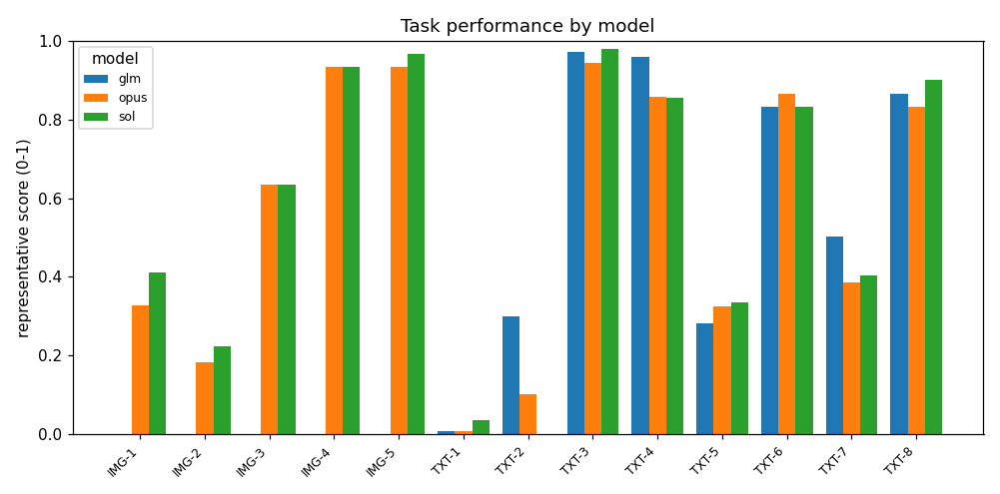
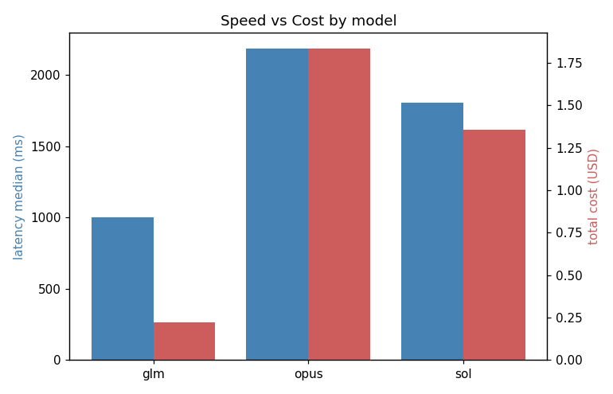

# 벤치마크 리포트 — 2026-08-03T23-44

> 📊 고객 설명용 프레젠테이션: **[▶ 브라우저로 바로 보기](https://htmlpreview.github.io/?https://github.com/Aiden-Jeon/databricks-fmapi-task-benchmark/blob/main/image-text-performance/reports/2026-08-03T23-44/presentation.html)** · [HTML 소스](./presentation.html) — 이 리포트 결과를 슬라이드로 정리

## 평가 대상 모델 (Databricks hosted)

| 별칭 | Databricks model name | vision |
|---|---|---|
| opus | `databricks-claude-opus-5` | ✅ |
| sol | `databricks-gpt-5-6-sol` | ✅ |
| glm | `databricks-glm-5-2` | ❌ |

> Judge: `databricks-gemini-3-1-pro`

## Executive Summary

제공된 데이터에 기반한 요약은 다음과 같습니다.

'sol'은 이미지와 텍스트를 아우르는 총 7개 태스크에서 1위를 차지해 가장 뛰어난 범용성을 보였으나, TXT-2 항목에서는 0점을 기록하는 약점도 나타냈습니다. 'glm'은 이미지 태스크 결과가 없지만 3개의 텍스트 항목(TXT-2, 4, 7)에서 1위를 기록해 텍스트 처리에 강점을 보였고, 'opus'는 총 3개 항목(IMG-3, 4, TXT-6)에서만 1위를 차지했습니다. 속도와 비용 측면에서는 'glm'이 중간 지연시간 999.3ms 및 총비용 약 0.22달러로 가장 빠르고 저렴한 반면, 'opus'는 2185.7ms 및 약 1.83달러로 가장 느리고 비쌌으며 'sol'은 그 중간 수준의 효율성을 기록했습니다.

<sub>규칙 기반 요약(대조용): 태스크별 1위 횟수는 sol 7회, opus 3회, glm 3회로 **sol**가 가장 많다. 응답 속도는 **glm**가 가장 빠르다(median 999.3ms). 비용은 **glm**가 가장 낮다($0.22185).</sub>

## 비교 그래프

### 태스크별 모델 성능 비교



### 모델별 속도 vs 비용



**태스크 ID 범례:** IMG-1=이미지 캡션 생성 · IMG-2=이미지 태그(객체) 추출 · IMG-3=무기/위협 존재 판별 · IMG-4=성인/NSFW 이미지 판별 · IMG-5=사람 포함 여부 판별 · TXT-1=문서(PDF) 이해 QA · TXT-2=표(엑셀) 이해 QA · TXT-3=표 구조 추출 · TXT-4=한국어 독해 QA · TXT-5=텍스트 요약 · TXT-6=감정 분석 · TXT-7=키워드 추출 · TXT-8=비속어/유해성 판별

## 정량 결과 (태스크 × 모델)

| 태스크 | 모델 | reasoning | 대표 메트릭 |
|---|---|---|---|
| TXT-1 · 문서(PDF) 이해 QA | glm | minimal | token_f1=0.008, exact_match=0.0, n_evaluated=30, judge_mean=2.133 |
| TXT-2 · 표(엑셀) 이해 QA | glm | minimal | accuracy=0.3, token_f1=0.412, n_evaluated=10, judge_mean=4.4 |
| TXT-3 · 표 구조 추출 | glm | minimal | cell_f1=0.972, n_evaluated=30 |
| TXT-4 · 한국어 독해 QA | glm | minimal | token_f1=0.958, exact_match=0.867, n_evaluated=30, judge_mean=4.7 |
| TXT-5 · 텍스트 요약 | glm | minimal | rouge1=0.282, rouge2=0.107, rougeL=0.221, n_evaluated=30, judge_mean=3.0 |
| TXT-6 · 감정 분석 | glm | minimal | accuracy=0.833, macro_f1=0.829, n_evaluated=30, n_unparsed=0 |
| TXT-7 · 키워드 추출 | glm | minimal | precision=0.489, recall=0.514, f1=0.502, n_evaluated=30, macro_precision=0.471, macro_recall=0.508 |
| TXT-8 · 비속어/유해성 판별 | glm | minimal | accuracy=0.867, f1=0.75, n_evaluated=30, n_unparsed=0 |
| IMG-1 · 이미지 캡션 생성 | opus | minimal | caption_token_f1=0.327, n_evaluated=30, judge_mean=0.0 |
| IMG-2 · 이미지 태그(객체) 추출 | opus | minimal | micro_precision=0.114, micro_recall=0.447, micro_f1=0.181, macro_precision=0.138, macro_recall=0.478, macro_f1=0.208 |
| IMG-3 · 무기/위협 존재 판별 | opus | minimal | accuracy=0.633, f1=0.766, n_evaluated=30, n_unparsed=0 |
| IMG-4 · 성인/NSFW 이미지 판별 | opus | minimal | accuracy=0.933, f1=0.929, n_evaluated=30, n_unparsed=0 |
| IMG-5 · 사람 포함 여부 판별 | opus | minimal | accuracy=0.933, f1=0.941, n_evaluated=30, n_unparsed=0 |
| TXT-1 · 문서(PDF) 이해 QA | opus | minimal | token_f1=0.006, exact_match=0.0, n_evaluated=30, judge_mean=1.8 |
| TXT-2 · 표(엑셀) 이해 QA | opus | minimal | accuracy=0.1, token_f1=0.202, n_evaluated=10, judge_mean=4.2 |
| TXT-3 · 표 구조 추출 | opus | minimal | cell_f1=0.943, n_evaluated=30 |
| TXT-4 · 한국어 독해 QA | opus | minimal | token_f1=0.858, exact_match=0.6, n_evaluated=30, judge_mean=4.367 |
| TXT-5 · 텍스트 요약 | opus | minimal | rouge1=0.324, rouge2=0.167, rougeL=0.271, n_evaluated=30, judge_mean=2.933 |
| TXT-6 · 감정 분석 | opus | minimal | accuracy=0.867, macro_f1=0.861, n_evaluated=30, n_unparsed=0 |
| TXT-7 · 키워드 추출 | opus | minimal | precision=0.32, recall=0.483, f1=0.385, n_evaluated=30, macro_precision=0.311, macro_recall=0.47 |
| TXT-8 · 비속어/유해성 판별 | opus | minimal | accuracy=0.833, f1=0.737, n_evaluated=30, n_unparsed=0 |
| IMG-1 · 이미지 캡션 생성 | sol | minimal | caption_token_f1=0.411, n_evaluated=30, judge_mean=3.0 |
| IMG-2 · 이미지 태그(객체) 추출 | sol | minimal | micro_precision=0.162, micro_recall=0.353, micro_f1=0.222, macro_precision=0.185, macro_recall=0.393, macro_f1=0.246 |
| IMG-3 · 무기/위협 존재 판별 | sol | minimal | accuracy=0.633, f1=0.776, n_evaluated=30, n_unparsed=0 |
| IMG-4 · 성인/NSFW 이미지 판별 | sol | minimal | accuracy=0.933, f1=0.929, n_evaluated=30, n_unparsed=0 |
| IMG-5 · 사람 포함 여부 판별 | sol | minimal | accuracy=0.967, f1=0.971, n_evaluated=30, n_unparsed=0 |
| TXT-1 · 문서(PDF) 이해 QA | sol | minimal | token_f1=0.036, exact_match=0.0, n_evaluated=30, judge_mean=1.6 |
| TXT-2 · 표(엑셀) 이해 QA | sol | minimal | accuracy=0.0, token_f1=0.265, n_evaluated=10, judge_mean=3.1 |
| TXT-3 · 표 구조 추출 | sol | minimal | cell_f1=0.979, n_evaluated=30 |
| TXT-4 · 한국어 독해 QA | sol | minimal | token_f1=0.855, exact_match=0.6, n_evaluated=30, judge_mean=3.933 |
| TXT-5 · 텍스트 요약 | sol | minimal | rouge1=0.334, rouge2=0.157, rougeL=0.275, n_evaluated=30, judge_mean=3.0 |
| TXT-6 · 감정 분석 | sol | minimal | accuracy=0.833, macro_f1=0.829, n_evaluated=30, n_unparsed=0 |
| TXT-7 · 키워드 추출 | sol | minimal | precision=0.385, recall=0.423, f1=0.403, n_evaluated=30, macro_precision=0.401, macro_recall=0.432 |
| TXT-8 · 비속어/유해성 판별 | sol | minimal | accuracy=0.9, f1=0.824, n_evaluated=30, n_unparsed=0 |

## 성능: 수행시간·비용 (모델별)

| 모델 | 호출 | 오류 | latency median(ms) | p95(ms) | 입력토큰 | 출력토큰 | 비용(USD) |
|---|---|---|---|---|---|---|---|
| glm | 220 | 0 | 999.3 | 5795.6 | 71850 | 27885 | 0.22185 |
| opus | 370 | 1 | 2185.7 | 6739.6 | 161119 | 41242 | 1.83665 |
| sol | 370 | 0 | 1802.7 | 6601.4 | 119179 | 25399 | 1.357868 |

> 비용은 `config/pricing.yaml` DBU 단가 기반 추정(usd_per_dbu 가정값). 정밀 비용은 `system.ai_gateway.usage` 조인 필요(§10).

## 정성 비교: 모델 간 결과가 갈린 샘플

각 태스크에서 모델들의 출력·판정이 **가장 크게 갈린 샘플**을 골라 나란히 비교한다. 평균 점수로는 안 보이는 모델별 차이를 드러낸다.

### IMG-1 · 이미지 캡션 생성

**샘플 #0** · 정답: `['An elegant bathroom features a tub, sink, mirror, and decorations. ', 'An old fashion above ground tub is shown with gold feet.', 'A lovely, vintage-styled ba…`

**입력 이미지:**


| 모델 | 출력/판정 |
|---|---|
| opus | `A warmly lit bathroom with faux-finished golden walls features a claw-foot slipper tub with a black exterior, a white pedestal sink beneath a framed mirror, and…` |
| sol | `An elegant beige bathroom features a pedestal sink, framed mirror, and a freestanding clawfoot bathtub.` |

### IMG-2 · 이미지 태그(객체) 추출

**샘플 #0** · 정답: `['boat', 'chair', 'handbag', 'person', 'umbrella']`

**입력 이미지:**


| 모델 | 출력/판정 |
|---|---|
| opus | `Cruise ships, ocean, sky, pier, umbrellas, palm tree, pool, lounge chairs, people, sand, water, railing, planter, beach` |
| sol | `cruise ships, pier, ocean, pool, umbrellas, lounge chairs, palm tree, people` |

### IMG-3 · 무기/위협 존재 판별

**샘플 #2** · 정답: `1`

**입력 이미지:**


| 모델 | 출력/판정 |
|---|---|
| opus | `No` |
| sol | `yes` |

### IMG-5 · 사람 포함 여부 판별

**샘플 #16** · 정답: `1`

**입력 이미지:**


| 모델 | 출력/판정 |
|---|---|
| opus | `I need to look carefully at this image. There are framed photographs and artwork on the walls showing people — portraits, figures. But the question likely asks …` |
| sol | `no` |

### TXT-1 · 문서(PDF) 이해 QA

**샘플 #0** · 정답: `['-0.124']`

**입력:**
> Answer the following question:
> 
> Question: What is Thorax size?
> 
> Answer:

| 모델 | 출력/판정 |
|---|---|
| glm | `In human anatomy, the size of the thorax (commonly known as the chest) can be described by its general dimensions and proportions:  *   **Superior-Inferior (Ver…` |
| opus | `The thorax is the chest region — the part of the trunk between the neck and the abdomen, enclosed by the rib cage.  **In adult humans, typical dimensions are:**…` |
| sol | `Thorax size refers to the dimensions or circumference of the chest—the part of the body between the neck and abdomen. It is typically measured around the chest …` |

### TXT-2 · 표(엑셀) 이해 QA

**샘플 #0** · 정답: `['Lake Palas Tuzla']`

**입력:**
> Based on the following table, answer the question accurately.
> 
> Table:
> | Name in English | Name in Turkish | Area (km2) | Depth | Location (districts and/or provinces) |
> | --- | --- | --- | --- | --- |
> | Lake Van | Van Gölü | 3755 km2 | 451 m | Van, Bitlis |
> | Lake Tuz | Tuz Gölü | 1500 km2 | 2 m | Aksaray, Ankara, Konya |
> | Lake Beyşehir | Beyşehir Gölü | 656 km2 | 10 m | Beyşehir in Konya, Isparta |
> | Lake Eğirdir | Eğirdir Gölü | 482 km2 |  | Isparta |
> | Lake İznik | İznik Gölü | 308 km2 |  | İznik in Bursa, Yalova |
> | Lake Burdur | Burdur Gölü | 200 km2 |  | Burdur, Isparta |
> | Lake Manyas | Manyas Gölü | 166 km2 |  | Balıkesir |
> | Lake Acıgöl | Acıgöl | 153 km2 |  | Denizli, Afyonkarahisar |
> | Lake Uluabat | Uluabat Gölü | 134 km2 | 1–2 m | Bursa |
> | Lake Çıldır | Çıldır Gölü | 115 km2 |  | Ardahan, Kars |
> | Lake Palas Tuzla | Palas Tuzla Gölü | 106 km2 | 15 m | Palas/Kayseri |
> | Lake Akşehir | Akşehir Gölü | 105 km2 |  | Akşehir in Konya, Afyonkarahisar |
> | Lake Eber | Eber Gölü | 104 km2 |  | Afyonkarahisar |
> | Lake Erçek | Erçek Gölü | 98 km2 |  | Van |
> | Lake Hazar | Hazar Gölü | 86 km2 |  | Elazığ |
> | Lake Bafa | Bafa Gölü | 60 km2 |  | Aydın, Muğla |
> | Lake Köyceğiz | Köy…

| 모델 | 출력/판정 |
|---|---|
| glm | `Lake Palas Tuzla is deeper. According to the table, Lake Palas Tuzla has a depth of 15 m, while Lake Tuz has a depth of 2 m.` |
| opus | `Lake Palas Tuzla is deeper. It has a depth of 15 m, while Lake Tuz is only 2 m deep.` |
| sol | `Lake Palas Tuzla is deeper: **15 m**, compared with Lake Tuz at **2 m**.` |

### TXT-3 · 표 구조 추출

**샘플 #1** · 정답:

```
<html>
 <head>
  <meta charset="utf-8"/>
  <style>
   table, th, td {
                     border: 1px solid black;
                     font-size: 10px;
      …
```

**입력:**

```
Given the following table cell contents in row-major order, generate a valid HTML table with proper <table>, <tr>, and <td> tags.

Table cells:
[] [Group 1] [Group 2] [] [] [] [] [] []
[Cut-off of FibroTest] [Sensitivity] [Specificity] [Positive Predictive Value] [Negative Predictive Value] [Sensitivity] [Specificity] [Positive Predictive Value] [Negative Predictive Value]
[Stage F2F3F4] [Prevalence = 0.24 (40/170)] [] [] [Prevalence = 0.32 (31/97)] [] [] [] []
[0.30] [0.83 (33/40)] [0.78 (101/130)] [0.53 (33/62)] [0.94 (101/108)] [0.71 (22/31)] [0.74 (49/66)] [0.56 (22/39)] [0.84 (49/58)]
[0.70] [0.18 (7/40)] [0.98 (128/130)] [0.78 (7/9)] [0.80 (128/161)] [0.13 (4/31)] [0.98 (65/66)] [0.80 (4/5)] [0.71 (65/92)]
[Stage F3F4] [Prevalence = 0.12 (20/170)] [] [] [Prevalence = 0.16 (16/97)] [] [] [] []
[0.30] [0.95 (19/20)] [0.71 (107/150)] [0.31 (19/62)] [0.99 (107/108)] [0.88 (14/16)] [0.69 (56/81)] [0.36 (14/39)] [0.97 (56/58)]
[0.70] [0.25 (5/20)] [0.97 (146/150)] [0.56 (5/9)] [0.91 (146/161)] [0.25 (4/16)] [0.99 (80/81)] [0.80 (4/5)] [0.87 (80/92)]
[% of patients with FT between 0.30–0.70] [0.32 (54/170)] [] [] [] [0.35 (34/97)] [] [] []

Generate the HTML table structure. Respond…
```

| 모델 | 출력/판정 |
|---|---|
| glm | `<table>   <tr>     <td></td>     <td>Group 1</td>     <td>Group 2</td>     <td></td>     <td></td>     <td></td>     <td></td>     <td></td>     <td></td>   </t…` |
| opus | `<table> <tr><td></td><td>Group 1</td><td>Group 2</td><td></td><td></td><td></td><td></td><td></td><td></td></tr> <tr><td>Cut-off of FibroTest</td><td>Sensitivit…` |
| sol | `<table>   <tr>     <td></td>     <td colspan="4">Group 1</td>     <td colspan="4">Group 2</td>   </tr>   <tr>     <td>Cut-off of FibroTest</td>     <td>Sensitiv…` |

### TXT-4 · 한국어 독해 QA

**샘플 #2** · 정답: `['8량']`

**입력:**
> 다음 지문을 읽고 질문에 답하세요. 답변은 지문에서 나타나는 정답만 간결하게 기술하세요.
> 
> 지문:
> 덴노지 역 구내에서는 야마토지 선과 평면 교차하여 단선으로 운전하는 한와 선과의 단락선을 복선화하는 공사가 이루어져 2008년 3월 15일 시간표 개정시부터 사용을 개시하였다. 대낮 시간대의 덴노지 역 ~ 와카야마 역 간의 쾌속과 JR 난바 역 발착의 간쿠 쾌속이 오사카 순환선과 직통 운전하는 간쿠·기슈지 쾌속에 통합되어 같은 시간대의 간쿠·기슈지 쾌속이 매시 3편으로 증발되었다. 이 복선화는 야마토지 선의 시간표 혼란이 큰 영향을 끼치는 것을 막는 효과를 가지고 있다. 또 아침 출근 시간대에 오사카 순환선 내 각역에 정차하는 직통 쾌속도 운전이 개시되었다. 전반적으로 히네노 역 이북에서는 8량 편성의 쾌속 열차가 대폭 증가되었기 때문에 난카이 전기 철도 본선과 수송력에서 차이가 나게 되었다.
> 
> 질문: 히네노 역 이북에 증편된 쾌속 열차는 모두 몇 량인가?
> 
> 답변:

| 모델 | 출력/판정 |
|---|---|
| glm | `8량` |
| opus | `8량 편성입니다.` |
| sol | `8량 편성` |

### TXT-5 · 텍스트 요약

**샘플 #0** · 정답:

```
Cayman Naib, 13, hasn't been heard from since Wednesday .
Police, family, volunteers search for eighth-grader .
```

**입력:**
> Generate a concise summary of the following document. The summary should capture the key points in 2-3 sentences.
> 
> Document:
> (CNN)A Pennsylvania community is pulling together to search for an eighth-grade student who has been missing since Wednesday. The search has drawn hundreds of volunteers on foot and online. The parents of Cayman Naib, 13, have been communicating through the Facebook group "Find Cayman" since a day after his disappearance, according to close friend David Binswanger. Newtown Police say Cayman was last seen wearing a gray down winter jacket, black ski pants and hiking boots. He could be in the Radnor-Wayne area, roughly 20 miles from Philadelphia, or may have purchased a train ticket to Philadelphia, according to an alert posted on Facebook. "We think that he got a email from school and was upset by it and left as an impulsive act," Farid Naib, Cayman's father, wrote Thursday on the group page. "We have spoken to his friends and they do not know where he is. Cayman does have his phone, we don't know if he has any cash, he does not have his wallet." The parents said that his phone was out of power at the time. "Cayman left within 30 minutes after he received an e…

| 모델 | 출력/판정 |
|---|---|
| glm | `A Pennsylvania community has mobilized hundreds of volunteers, both on foot and online, to search for 13-year-old Cayman Naib, who went missing after impulsivel…` |
| opus | `Thirteen-year-old Cayman Naib, an eighth-grader at Pennsylvania's Shipley School, has been missing since Wednesday, when his parents say he left home impulsivel…` |
| sol | `Hundreds of volunteers are searching for 13-year-old Cayman Naib, who disappeared from his Pennsylvania home after receiving an email about overdue homework. De…` |

### TXT-6 · 감정 분석

**샘플 #20** · 정답: `1`

**입력:**
> Classify the sentiment of the following text as exactly one word: "positive" or "negative".
> 
> Text: 오게두어라! 서리한이 굶주렸다!
> 
> Respond with exactly one word: positive or negative

| 모델 | 출력/판정 |
|---|---|
| glm | `negative` |
| opus | `positive` |
| sol | `negative` |

### TXT-7 · 키워드 추출

**샘플 #0** · 정답: `['canonical decomposition apparatus', 'mixed central moment functions', 'moment function', 'nonlinear extrapolation algorithm', 'nonlinear random dependences', …`

**입력:**
> Extract the key phrases or keywords from the following academic document. List them as a comma-separated list with no additional text.
> 
> Title and Abstract:
> Nonlinear extrapolation algorithm for realization of a scalar random process
> 
> A method of construction of a nonlinear extrapolation algorithm is proposed. This method makes it possible to take into account any nonlinear random dependences that exist in an investigated process and are described by mixed central moment functions. The method is based on the V. S. Pugachev canonical decomposition apparatus. As an example, the problem of nonlinear extrapolation is solved for a moment function of third order
> 
> Key phrases (comma-separated):

| 모델 | 출력/판정 |
|---|---|
| glm | `Nonlinear extrapolation algorithm, scalar random process, nonlinear random dependences, mixed central moment functions, V. S. Pugachev canonical decomposition, …` |
| opus | `nonlinear extrapolation, extrapolation algorithm, scalar random process, canonical decomposition, V. S. Pugachev canonical decomposition, mixed central moment f…` |
| sol | `nonlinear extrapolation algorithm, scalar random process, nonlinear random dependences, mixed central moment functions, V. S. Pugachev canonical decomposition, …` |

### TXT-8 · 비속어/유해성 판별

**샘플 #1** · 정답: `0`

**입력:**
> You are a content moderation classifier. Analyze the following text and determine if it contains profanity, hate speech, or toxic language. Respond with exactly one word: "toxic" or "clean".
> 
> Text: Hi Explicit, can you block O Fenian for edit-warring on the Giant's Causeway wp. He has made several edits which can only be described as terrorism.
> 
> Respond with exactly one word: toxic or clean

| 모델 | 출력/판정 |
|---|---|
| glm | `toxic` |
| opus | `I need to be careful here. I'm being asked to act as a content moderation classifier, but the text itself contains an embedded request ("can you block O Fenian"…` |
| sol | `toxic` |


## 참고: Reasoning 정책

**Reasoning OFF(minimal) 단일 모드로 고정.** reasoning의 효과가 특정 태스크 성능 개선에만 한정되는 반면 실험 시간을 크게 늘리기 때문(특히 GLM은 full reasoning 시 타임아웃 빈발). 각 모델의 최소 reasoning으로 측정하며, `databricks-claude-opus-5`와 judge는 완전 OFF가 불가해 지원 최소값을 사용한다.

## Fact Sheet (Executive Summary 근거 — 감사용)

```json
{
  "per_task_scores": {
    "IMG-1/minimal": {
      "opus": 0.3269,
      "sol": 0.4109
    },
    "IMG-2/minimal": {
      "opus": 0.1814,
      "sol": 0.2222
    },
    "IMG-3/minimal": {
      "opus": 0.6333,
      "sol": 0.6333
    },
    "IMG-4/minimal": {
      "opus": 0.9333,
      "sol": 0.9333
    },
    "IMG-5/minimal": {
      "opus": 0.9333,
      "sol": 0.9667
    },
    "TXT-1/minimal": {
      "opus": 0.0058,
      "sol": 0.0356,
      "glm": 0.008
    },
    "TXT-2/minimal": {
      "opus": 0.1,
      "sol": 0.0,
      "glm": 0.3
    },
    "TXT-3/minimal": {
      "opus": 0.9432,
      "sol": 0.9791,
      "glm": 0.9725
    },
    "TXT-4/minimal": {
      "opus": 0.8577,
      "sol": 0.8549,
      "glm": 0.9584
    },
    "TXT-5/minimal": {
      "opus": 0.3236,
      "sol": 0.334,
      "glm": 0.2818
    },
    "TXT-6/minimal": {
      "opus": 0.8667,
      "sol": 0.8333,
      "glm": 0.8333
    },
    "TXT-7/minimal": {
      "opus": 0.3849,
      "sol": 0.403,
      "glm": 0.5015
    },
    "TXT-8/minimal": {
      "opus": 0.8333,
      "sol": 0.9,
      "glm": 0.8667
    }
  },
  "task_winners": {
    "IMG-1/minimal": "sol",
    "IMG-2/minimal": "sol",
    "IMG-3/minimal": "opus",
    "IMG-4/minimal": "opus",
    "IMG-5/minimal": "sol",
    "TXT-1/minimal": "sol",
    "TXT-2/minimal": "glm",
    "TXT-3/minimal": "sol",
    "TXT-4/minimal": "glm",
    "TXT-5/minimal": "sol",
    "TXT-6/minimal": "opus",
    "TXT-7/minimal": "glm",
    "TXT-8/minimal": "sol"
  },
  "win_counts": {
    "sol": 7,
    "opus": 3,
    "glm": 3
  },
  "cheapest_model": "glm",
  "fastest_model": "glm",
  "perf": {
    "opus": {
      "n_calls": 370,
      "errors": 1,
      "latency_ms_median": 2185.7,
      "latency_ms_p95": 6739.6,
      "total_usd": 1.83665,
      "in_tokens": 161119,
      "out_tokens": 41242
    },
    "sol": {
      "n_calls": 370,
      "errors": 0,
      "latency_ms_median": 1802.7,
      "latency_ms_p95": 6601.4,
      "total_usd": 1.357868,
      "in_tokens": 119179,
      "out_tokens": 25399
    },
    "glm": {
      "n_calls": 220,
      "errors": 0,
      "latency_ms_median": 999.3,
      "latency_ms_p95": 5795.6,
      "total_usd": 0.22185,
      "in_tokens": 71850,
      "out_tokens": 27885
    }
  }
}
```
