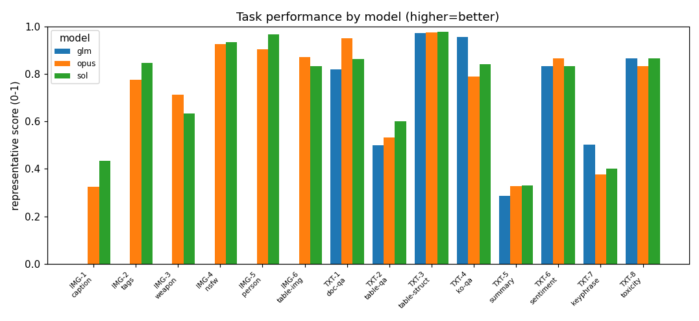
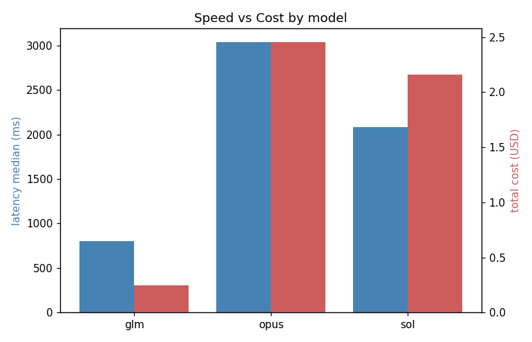

# 벤치마크 리포트 — 2026-08-05T13-00

> 📊 고객 설명용 프레젠테이션: **[▶ 브라우저로 바로 보기](https://htmlpreview.github.io/?https://github.com/Aiden-Jeon/databricks-fmapi-task-benchmark/blob/main/image-text-performance/reports/2026-08-05T13-00/presentation.html)** · [HTML 소스](./presentation.html) — 이 리포트 결과를 슬라이드로 정리

## 평가 대상 모델 (Databricks hosted)

| 별칭 | Databricks model name | vision |
|---|---|---|
| opus | `databricks-claude-opus-5` | ✅ |
| sol | `databricks-gpt-5-6-sol` | ✅ |
| glm | `databricks-glm-5-2` | ❌ |

> Judge: `databricks-gemini-3-1-pro`

## Executive Summary

제공된 데이터에 따르면 'sol' 모델은 총 8개 태스크에서 1위를 차지해 이미지와 텍스트 전반에서 가장 우수한 성과를 보인 반면, 'glm'은 텍스트 분야(3개 우승)에서만 두각을 나타냈고 'opus'는 20번의 오류가 발생해 안정성이 가장 떨어졌습니다. 속도와 비용 면에서는 'glm'이 중간값 798.7ms의 가장 빠른 속도와 총 $0.25의 최저 비용을 기록해 압도적인 가성비를 자랑합니다. 반면 'opus'는 가장 느린 속도(중간값 3038.6ms)와 최고 비용($2.45)을 기록해 효율이 낮습니다. 결과적으로 'sol'은 'glm'보다 비싸고 느리지만(총 $2.15, 중간값 2084.6ms), 에러 없이 가장 높은 종합 성능을 제공하는 훌륭한 트레이드오프를 보여줍니다.

<sub>규칙 기반 요약(대조용): 태스크별 1위 횟수는 sol 8회, opus 4회, glm 3회로 **sol**가 가장 많다. 이 중 1개 태스크는 동점이라 공동 1위로 집계했다. 응답 속도는 **glm**가 가장 빠르다(median 798.7ms). 비용은 **glm**가 가장 낮다($0.2502).</sub>

## 비교 그래프

### 태스크별 모델 성능 비교



### 모델별 속도 vs 비용



**태스크 ID 범례:** IMG-1=이미지 캡션 생성 · IMG-2=이미지 태그(객체) 추출 · IMG-3=무기/위협 존재 판별 · IMG-4=성인/NSFW 이미지 판별 · IMG-5=사람 포함 여부 판별 · IMG-6=표 이미지 구조 추출 · TXT-1=문서(PDF) 이해 QA · TXT-2=표(엑셀) 이해 QA · TXT-3=표 구조 추출 · TXT-4=한국어 독해 QA · TXT-5=텍스트 요약 · TXT-6=감정 분석 · TXT-7=키워드 추출 · TXT-8=비속어/유해성 판별

## 정량 결과 (태스크 × 모델)

| 태스크 | 모델 | reasoning | 대표 메트릭 | 실패 |
|---|---|---|---|---|
| TXT-1 · 문서(PDF) 이해 QA | glm | minimal | anls=0.819, token_f1=0.799, exact_match=0.733, n_evaluated=30, judge_mean=4.367 | — |
| TXT-2 · 표(엑셀) 이해 QA | glm | minimal | accuracy=0.5, token_f1=0.539, n_evaluated=30, judge_mean=3.433 | — |
| TXT-3 · 표 구조 추출 | glm | minimal | cell_f1=0.972, n_evaluated=30 | — |
| TXT-4 · 한국어 독해 QA | glm | minimal | token_f1=0.955, exact_match=0.833, n_evaluated=30, judge_mean=5.0 | — |
| TXT-5 · 텍스트 요약 | glm | minimal | rouge1=0.287, rouge2=0.135, rougeL=0.234, n_evaluated=30, bertscore_f1=0.736, bertscore_n=30 | judge 1 |
| TXT-6 · 감정 분석 | glm | minimal | accuracy=0.833, macro_f1=0.829, n_evaluated=30, n_unparsed=0 | — |
| TXT-7 · 키워드 추출 | glm | minimal | precision=0.495, recall=0.511, f1=0.503, n_evaluated=30, macro_precision=0.482, macro_recall=0.497 | — |
| TXT-8 · 비속어/유해성 판별 | glm | minimal | accuracy=0.867, f1=0.778, n_evaluated=30, n_unparsed=0 | — |
| IMG-1 · 이미지 캡션 생성 | opus | minimal | caption_token_f1=0.326, n_evaluated=30, bertscore_f1=0.746, bertscore_n=30, judge_mean=4.167 | — |
| IMG-2 · 이미지 태그(객체) 추출 | opus | minimal | micro_precision=0.653, micro_recall=0.954, micro_f1=0.775, macro_precision=0.759, macro_recall=0.94, macro_f1=0.81 | 호출 5/30 |
| IMG-3 · 무기/위협 존재 판별 | opus | minimal | accuracy=0.714, f1=0.818, n_evaluated=28, n_unparsed=2 | 호출 2/30 |
| IMG-4 · 성인/NSFW 이미지 판별 | opus | minimal | accuracy=0.926, f1=0.917, n_evaluated=27, n_unparsed=3 | 호출 3/30 |
| IMG-5 · 사람 포함 여부 판별 | opus | minimal | accuracy=0.905, f1=0.923, n_evaluated=21, n_unparsed=9 | 호출 9/30 |
| IMG-6 · 표 이미지 구조 추출 | opus | minimal | cell_f1=0.872, n_evaluated=30 | — |
| TXT-1 · 문서(PDF) 이해 QA | opus | minimal | anls=0.952, token_f1=0.96, exact_match=0.933, n_evaluated=30, judge_mean=4.965 | judge 1 |
| TXT-2 · 표(엑셀) 이해 QA | opus | minimal | accuracy=0.533, token_f1=0.589, n_evaluated=30, judge_mean=4.267 | — |
| TXT-3 · 표 구조 추출 | opus | minimal | cell_f1=0.976, n_evaluated=29, n_skipped=1 | 호출 1/30 |
| TXT-4 · 한국어 독해 QA | opus | minimal | token_f1=0.788, exact_match=0.567, n_evaluated=30, judge_mean=5.0 | — |
| TXT-5 · 텍스트 요약 | opus | minimal | rouge1=0.326, rouge2=0.181, rougeL=0.274, n_evaluated=30, bertscore_f1=0.737, bertscore_n=30 | — |
| TXT-6 · 감정 분석 | opus | minimal | accuracy=0.867, macro_f1=0.861, n_evaluated=30, n_unparsed=0 | — |
| TXT-7 · 키워드 추출 | opus | minimal | precision=0.315, recall=0.467, f1=0.376, n_evaluated=30, macro_precision=0.315, macro_recall=0.483 | — |
| TXT-8 · 비속어/유해성 판별 | opus | minimal | accuracy=0.833, f1=0.737, n_evaluated=30, n_unparsed=0 | — |
| IMG-1 · 이미지 캡션 생성 | sol | minimal | caption_token_f1=0.433, n_evaluated=30, bertscore_f1=0.785, bertscore_n=30, judge_mean=3.733 | — |
| IMG-2 · 이미지 태그(객체) 추출 | sol | minimal | micro_precision=0.847, micro_recall=0.847, micro_f1=0.847, macro_precision=0.904, macro_recall=0.874, macro_f1=0.87 | — |
| IMG-3 · 무기/위협 존재 판별 | sol | minimal | accuracy=0.633, f1=0.776, n_evaluated=30, n_unparsed=0 | — |
| IMG-4 · 성인/NSFW 이미지 판별 | sol | minimal | accuracy=0.933, f1=0.929, n_evaluated=30, n_unparsed=0 | — |
| IMG-5 · 사람 포함 여부 판별 | sol | minimal | accuracy=0.967, f1=0.971, n_evaluated=30, n_unparsed=0 | — |
| IMG-6 · 표 이미지 구조 추출 | sol | minimal | cell_f1=0.833, n_evaluated=30 | — |
| TXT-1 · 문서(PDF) 이해 QA | sol | minimal | anls=0.864, token_f1=0.841, exact_match=0.833, n_evaluated=30, judge_mean=4.567 | — |
| TXT-2 · 표(엑셀) 이해 QA | sol | minimal | accuracy=0.6, token_f1=0.656, n_evaluated=30, judge_mean=3.867 | — |
| TXT-3 · 표 구조 추출 | sol | minimal | cell_f1=0.977, n_evaluated=30 | — |
| TXT-4 · 한국어 독해 QA | sol | minimal | token_f1=0.84, exact_match=0.6, n_evaluated=30, judge_mean=5.0 | — |
| TXT-5 · 텍스트 요약 | sol | minimal | rouge1=0.33, rouge2=0.16, rougeL=0.271, n_evaluated=30, bertscore_f1=0.734, bertscore_n=30 | judge 1 |
| TXT-6 · 감정 분석 | sol | minimal | accuracy=0.833, macro_f1=0.829, n_evaluated=30, n_unparsed=0 | — |
| TXT-7 · 키워드 추출 | sol | minimal | precision=0.384, recall=0.42, f1=0.401, n_evaluated=30, macro_precision=0.394, macro_recall=0.447 | — |
| TXT-8 · 비속어/유해성 판별 | sol | minimal | accuracy=0.867, f1=0.778, n_evaluated=30, n_unparsed=0 | — |

> **채점 조건**
> - 한국어 토큰화: **형태소(mecab)** — ROUGE·Token-F1이 형태소 기준이다.
> - 호출 실패: 5개 셀에 실패가 있다(위 '실패' 열). 실패한 샘플은 **채점에서 제외**하므로(0점으로 세지 않음) 그 셀의 점수는 성공한 샘플 기준이다 — 표의 `n_evaluated`가 요청 샘플 수보다 작은 이유다. 실패는 엔드포인트 문제이지 모델 성능이 아니다.
> - judge 실패(응답 잘림·형식 이탈)는 해당 샘플을 평균에서 **제외**하고 위 표에 건수를 표기한다. 중간값으로 메우지 않는다.

### 통계 유의성 (judge 점수, Wilcoxon signed-rank)

| 태스크 | 모델 쌍 | judge 평균 | n(짝) | 판정 |
|---|---|---|---|---|
| IMG-1 · 이미지 캡션 생성 | opus vs sol | 4.17 vs 3.73 | 30 | 유의하지 않음 (p=0.1050) |
| TXT-1 · 문서(PDF) 이해 QA | glm vs opus | 4.48 vs 4.97 | 29 | 유의하지 않음 (p=0.0588) |
| TXT-1 · 문서(PDF) 이해 QA | glm vs sol | 4.37 vs 4.57 | 30 | 유의하지 않음 (p=0.1975) |
| TXT-1 · 문서(PDF) 이해 QA | opus vs sol | 4.97 vs 4.69 | 29 | 유의하지 않음 (p=0.1936) |
| TXT-2 · 표(엑셀) 이해 QA | glm vs opus | 3.43 vs 4.27 | 30 | **유의** (p=0.0114) → opus 우세 |
| TXT-2 · 표(엑셀) 이해 QA | glm vs sol | 3.43 vs 3.87 | 30 | 유의하지 않음 (p=0.1058) |
| TXT-2 · 표(엑셀) 이해 QA | opus vs sol | 4.27 vs 3.87 | 30 | 유의하지 않음 (p=0.1957) |
| TXT-4 · 한국어 독해 QA | glm vs opus | 5.00 vs 5.00 | 30 | 판정 불가(차이 없음/표본 부족) |
| TXT-4 · 한국어 독해 QA | glm vs sol | 5.00 vs 5.00 | 30 | 판정 불가(차이 없음/표본 부족) |
| TXT-4 · 한국어 독해 QA | opus vs sol | 5.00 vs 5.00 | 30 | 판정 불가(차이 없음/표본 부족) |
| TXT-5 · 텍스트 요약 | glm vs opus | 4.59 vs 4.90 | 29 | **유의** (p=0.0209) → opus 우세 |
| TXT-5 · 텍스트 요약 | glm vs sol | 4.64 vs 4.86 | 28 | 유의하지 않음 (p=0.0836) |
| TXT-5 · 텍스트 요약 | opus vs sol | 4.90 vs 4.83 | 29 | 유의하지 않음 (p=0.4142) |

> Wilcoxon signed-rank(양측, α=0.05). **judge 점수에만** 적용한다 — 정량 메트릭은 셀 단위 평균만 저장해(스트리밍 O(1) 설계) 샘플을 짝지을 수 없다. '유의하지 않음'은 두 모델이 같다는 뜻이 아니라 이 표본에서 차이를 확인할 수 없다는 뜻이다.

## 성능: 수행시간·비용 (모델별)

| 모델 | 호출 | 오류 | latency median(ms) | p95(ms) | 입력토큰 | 출력토큰 | 비용(USD) |
|---|---|---|---|---|---|---|---|
| glm | 240 | 0 | 798.7 | 6879.6 | 102954 | 24574 | 0.2502 |
| opus | 420 | 20 | 3038.6 | 16721.5 | 213672 | 55529 | 2.456592 |
| sol | 420 | 0 | 2084.6 | 9770.4 | 161718 | 45010 | 2.158894 |

> 비용은 `config/pricing.yaml` DBU 단가 기반 추정(usd_per_dbu 가정값). 정밀 비용은 `system.ai_gateway.usage` 조인 필요(§10).

## 정성 비교: 모델 간 결과가 갈린 샘플

각 태스크에서 모델들의 출력·판정이 **가장 크게 갈린 샘플**을 골라 나란히 비교한다. 평균 점수로는 안 보이는 모델별 차이를 드러낸다.

### IMG-1 · 이미지 캡션 생성

**샘플 #0** · _모델 간 판정이 갈린 케이스_ · 정답: `['An elegant bathroom features a tub, sink, mirror, and decorations. ', 'An old fashion above ground tub is shown with gold feet.', 'A lovely, vintage-styled ba…`

**질문/지시:** Describe this image in one sentence.

**입력 이미지:**


| 모델 | 정답? | 출력/판정 |
|---|:--:|---|
| opus | ❌ | `A warmly lit bathroom with golden textured walls features a classic black and white clawfoot tub with brass fixtures, a pedestal sink beneath a framed mirror, a…` |
| sol | ❌ | `An elegant bathroom features a pedestal sink, framed mirror, and vintage black-and-white clawfoot bathtub against textured beige walls.` |

### IMG-2 · 이미지 태그(객체) 추출

**샘플 #0** · _모델 간 판정이 갈린 케이스_ · 정답: `['boat', 'chair', 'handbag', 'person', 'umbrella']`

**질문/지시:** List every object from the label set below that is visible in this image.

**입력 이미지:**


| 모델 | 정답? | 출력/판정 |
|---|:--:|---|
| opus | ❌ | `__ERROR__: FMAPIError: databricks-claude-opus-5 재시도 5회 모두 실패: databricks-claude-opus-5 HTTP 502: {"error_code":"INTERNAL_ERROR","message":"The server received a…` |
| sol | ✅ | `boat, person, umbrella, chair, potted plant` |

### IMG-3 · 무기/위협 존재 판별

**샘플 #10** · _모델 간 판정이 갈린 케이스_ · 정답: `0`

**질문/지시:** Does this image contain a weapon or threat (gun, knife, pistol, rifle, blood, etc.)? Answer exactly yes or no.

**입력 이미지:**


| 모델 | 정답? | 출력/판정 |
|---|:--:|---|
| opus | ❌ | `__ERROR__: FMAPIError: databricks-claude-opus-5 재시도 5회 모두 실패: databricks-claude-opus-5 HTTP 502: {"error_code":"INTERNAL_ERROR","message":"The server received a…` |
| sol | ❌ | `yes` |

### IMG-4 · 성인/NSFW 이미지 판별

**샘플 #1** (민감 태스크 — 입력 비표시, 판정값만) · _모델 간 판정이 갈린 케이스_ · 정답: `1`

**질문/지시:** You are a content-safety classifier. Does this image contain adult/NSFW (sexually explicit) content? Answer exactly 'nsfw' or 'safe'.

| 모델 | 정답? | 출력/판정 |
|---|:--:|---|
| opus | ❌ | `__ERROR__: FMAPIError: databricks-claude-opus-5 재시도 5회 모두 실패: databricks-claude-opus-5 HTTP 502: {"error_code":"INTERNAL_ERROR","message":"The server received a…` |
| sol | — | `nsfw` |

### IMG-5 · 사람 포함 여부 판별

**샘플 #0** · _모델 간 판정이 갈린 케이스_ · 정답: `1`

**질문/지시:** Is there a person visible in this image? Answer exactly yes or no.

**입력 이미지:**


| 모델 | 정답? | 출력/판정 |
|---|:--:|---|
| opus | ❌ | `__ERROR__: FMAPIError: databricks-claude-opus-5 재시도 5회 모두 실패: databricks-claude-opus-5 HTTP 502: {"error_code":"INTERNAL_ERROR","message":"The server received a…` |
| sol | ✅ | `yes` |

### IMG-6 · 표 이미지 구조 추출

**샘플 #0** · _모델 간 판정이 갈린 케이스_ · 정답:

```
<html>
 <head>
  <meta charset="utf-8"/>
  <style>
   table, th, td {
                     border: 1px solid black;
                     font-size: 10px;
      …
```

**질문/지시:** This image contains a table. Extract the table and output it as a valid HTML table using <table>, <tr>, and <td> tags, preserving the row/column structure and cell text exactly as shown. Respond with ONLY the HTML, no explanation.

**입력 이미지:**


| 모델 | 정답? | 출력/판정 |
|---|:--:|---|
| opus | ✅ | `<table> <tr><td>Clinical parameters</td><td colspan="2">WWOX intensity</td><td>Total</td><td>p value</td></tr> <tr><td></td><td>Low (Negative/Weak)</td><td>High…` |
| sol | ✅ | `<table>   <tr>     <td>Clinical parameters</td>     <td colspan="2">WWOX intensity</td>     <td>Total</td>     <td>p value</td>   </tr>   <tr>     <td></td>    …` |

### TXT-1 · 문서(PDF) 이해 QA

**샘플 #18** · _모델 간 판정이 갈린 케이스_ · 정답: `['Aashirvaad']`

**질문/지시:** What is the brand name of the 'Atta with multigrains' shown in the picture?

**입력:**
> Based on the following document text, answer the question.
> 
> Document text:
> ITC Limited REPORT AND ACCOUNTS 2013 A slew of innovative products are already in the market India's most premium, sugarfree power mints packed in and there is a continuous pipeline of such products that a stylish black case and Candyman Creme Lacto which are being readied for launch. Such innovation finds is made with the goodness of milk and caramel with a articulation in brand variants such as Aashirvaad Atta rich, delicious creme filling. with Multigrains which is designed as a healthier nourishment option, smooth non-sticky Sunfeast Yippee! In the personal care products category, ITC has Noodles in a unique round block and Sunfeast Yippee! developed Liquid Crystal Freezing Technology for its Chinese Masala - a unique combination of flavours which Fiama Di Wills brand, a revolutionary method to freeze gives the consumer tasty Chinese noodles in minutes. the goodness of shower gels in soap. Equally unique in their value propositions are the Fiama Di Wills Men Aqua This spirit of innovation is also visible in a range of Pulse De-stressing and brightening Face Wash, products developed for the Biscuits segme…

| 모델 | 정답? | 출력/판정 |
|---|:--:|---|
| glm | ✅ | `Aashirvaad Atta` |
| opus | ✅ | `Aashirvaad` |
| sol | ✅ | `Aashirvaad Atta Multigrains` |

### TXT-2 · 표(엑셀) 이해 QA

**샘플 #1** · _모델 간 판정이 갈린 케이스_ · 정답: `['9']`

**질문/지시:** how many elections had at least a 0.2 percentage of constituency votes?

**입력:**
> Based on the following table, answer the question.
> 
> Table:
> | Election year | # of\nconstituency votes | % of\nconstituency votes | +/– | # of\nparty list votes | % of\nparty list votes | +/– | # of\noverall seats won |
> | --- | --- | --- | --- | --- | --- | --- | --- |
> | 1965 | 587,216 | 1.8 | 1.8 | 664,193 | 2.0 | 2.0 | 0 / 518 |
> | 1969 | 1,189,375 | 3.6 | 1.8 | 1,422,010 | 4.3 | 2.3 | 0 / 518 |
> | 1972 | 194,389 | 0.5 | 3.1 | 207,465 | 0.6 | 3.7 | 0 / 518 |
> | 1976 | 136.023 | 0.4 | 0.1 | 122,661 | 0.3 | 0.3 | 0 / 518 |
> | 1980 |  |  |  | 68,096 | 0.2 | 0.1 | 0 / 497 |
> | 1983 | 57,112 | 0.1 | 0.3 | 91,095 | 0.2 | 0 | 0 / 498 |
> | 1987 | 182,880 | 0.5 | 0.4 | 227,054 | 0.6 | 0.4 | 0 / 497 |
> | 1990 | 190,105 | 0.4 | 0.1 | 145,776 | 0.3 | 0.3 | 0 / 662 |
> | 1998 | 45,043 | 0.1 | 0.3 | 126,571 | 0.3 | 0 | 0 / 669 |
> | 2002 | 103,209 | 0.1 | 0.1 | 215,232 | 0.4 | 0.1 | 0 / 603 |
> | 2005 | 857.777 | 1.8 | 1.6 | 748,568 | 1.6 | 1.2 | 0 / 614 |
> | 2009 | 768,442 | 1.8 | 0 | 635,525 | 1.5 | 0.1 | 0 / 620 |
> | 2013 | 634,842 | 1.5 | 0.3 | 560,660 | 1.3 | 0.2 | 0 / 630 |
> 
> Question: how many elections had at least a 0.2 percentage of constituency votes?
> 
> Output ONLY the answer value(s) copied from the…

| 모델 | 정답? | 출력/판정 |
|---|:--:|---|
| glm | ❌ | `1965, 1969, 1972, 1976, 1987, 1990, 1998, 2002, 2005, 2009, 2013` |
| opus | ✅ | `<thinking>Count elections with % of constituency votes >= 0.2.  1965: 1.8 ✓ 1969: 3.6 ✓ 1972: 0.5 ✓ 1976: 0.4 ✓ 1980: blank ✗ 1983: 0.1 ✗ 1987: 0.5 ✓ 1990: 0.4 …` |
| sol | ❌ | `10` |

### TXT-3 · 표 구조 추출

**샘플 #1** · _모델 간 판정이 갈린 케이스_ · 정답:

```
<html>
 <head>
  <meta charset="utf-8"/>
  <style>
   table, th, td {
                     border: 1px solid black;
                     font-size: 10px;
      …
```

**질문/지시:** Given the following table cell contents in row-major order, generate a valid HTML table with proper <table>, <tr>, and <td> tags.

**입력:**

```
Given the following table cell contents in row-major order, generate a valid HTML table with proper <table>, <tr>, and <td> tags.

Table cells:
[] [Group 1] [Group 2] [] [] [] [] [] []
[Cut-off of FibroTest] [Sensitivity] [Specificity] [Positive Predictive Value] [Negative Predictive Value] [Sensitivity] [Specificity] [Positive Predictive Value] [Negative Predictive Value]
[Stage F2F3F4] [Prevalence = 0.24 (40/170)] [] [] [Prevalence = 0.32 (31/97)] [] [] [] []
[0.30] [0.83 (33/40)] [0.78 (101/130)] [0.53 (33/62)] [0.94 (101/108)] [0.71 (22/31)] [0.74 (49/66)] [0.56 (22/39)] [0.84 (49/58)]
[0.70] [0.18 (7/40)] [0.98 (128/130)] [0.78 (7/9)] [0.80 (128/161)] [0.13 (4/31)] [0.98 (65/66)] [0.80 (4/5)] [0.71 (65/92)]
[Stage F3F4] [Prevalence = 0.12 (20/170)] [] [] [Prevalence = 0.16 (16/97)] [] [] [] []
[0.30] [0.95 (19/20)] [0.71 (107/150)] [0.31 (19/62)] [0.99 (107/108)] [0.88 (14/16)] [0.69 (56/81)] [0.36 (14/39)] [0.97 (56/58)]
[0.70] [0.25 (5/20)] [0.97 (146/150)] [0.56 (5/9)] [0.91 (146/161)] [0.25 (4/16)] [0.99 (80/81)] [0.80 (4/5)] [0.87 (80/92)]
[% of patients with FT between 0.30–0.70] [0.32 (54/170)] [] [] [] [0.35 (34/97)] [] [] []

Generate the HTML table structure. Respond…
```

| 모델 | 정답? | 출력/판정 |
|---|:--:|---|
| glm | ✅ | `'''html <table>   <tr>     <td></td>     <td>Group 1</td>     <td>Group 2</td>     <td></td>     <td></td>     <td></td>     <td></td>     <td></td>     <td></t…` |
| opus | ✅ | `<table> <tr><td></td><td>Group 1</td><td>Group 2</td><td></td><td></td><td></td><td></td><td></td><td></td></tr> <tr><td>Cut-off of FibroTest</td><td>Sensitivit…` |
| sol | ✅ | `<table>   <tr>     <td></td>     <td colspan="4">Group 1</td>     <td colspan="4">Group 2</td>   </tr>   <tr>     <td>Cut-off of FibroTest</td>     <td>Sensitiv…` |

### TXT-4 · 한국어 독해 QA

**샘플 #2** · _모델 간 판정이 갈린 케이스_ · 정답: `['8량']`

**질문/지시:** 히네노 역 이북에 증편된 쾌속 열차는 모두 몇 량인가?

**입력:**
> 다음 지문을 읽고 질문에 답하세요. 답변은 지문에서 나타나는 정답만 간결하게 기술하세요.
> 
> 지문:
> 덴노지 역 구내에서는 야마토지 선과 평면 교차하여 단선으로 운전하는 한와 선과의 단락선을 복선화하는 공사가 이루어져 2008년 3월 15일 시간표 개정시부터 사용을 개시하였다. 대낮 시간대의 덴노지 역 ~ 와카야마 역 간의 쾌속과 JR 난바 역 발착의 간쿠 쾌속이 오사카 순환선과 직통 운전하는 간쿠·기슈지 쾌속에 통합되어 같은 시간대의 간쿠·기슈지 쾌속이 매시 3편으로 증발되었다. 이 복선화는 야마토지 선의 시간표 혼란이 큰 영향을 끼치는 것을 막는 효과를 가지고 있다. 또 아침 출근 시간대에 오사카 순환선 내 각역에 정차하는 직통 쾌속도 운전이 개시되었다. 전반적으로 히네노 역 이북에서는 8량 편성의 쾌속 열차가 대폭 증가되었기 때문에 난카이 전기 철도 본선과 수송력에서 차이가 나게 되었다.
> 
> 질문: 히네노 역 이북에 증편된 쾌속 열차는 모두 몇 량인가?
> 
> 답변:

| 모델 | 정답? | 출력/판정 |
|---|:--:|---|
| glm | ✅ | `8량` |
| opus | ✅ | `8량 편성` |
| sol | ✅ | `8량 편성입니다.` |

### TXT-5 · 텍스트 요약

**샘플 #0** · _모델 간 판정이 갈린 케이스_ · 정답:

```
Cayman Naib, 13, hasn't been heard from since Wednesday .
Police, family, volunteers search for eighth-grader .
```

**질문/지시:** Generate a concise summary of the following document. The summary should capture the key points in 2-3 sentences.

**입력:**
> Generate a concise summary of the following document. The summary should capture the key points in 2-3 sentences.
> 
> Document:
> (CNN)A Pennsylvania community is pulling together to search for an eighth-grade student who has been missing since Wednesday. The search has drawn hundreds of volunteers on foot and online. The parents of Cayman Naib, 13, have been communicating through the Facebook group "Find Cayman" since a day after his disappearance, according to close friend David Binswanger. Newtown Police say Cayman was last seen wearing a gray down winter jacket, black ski pants and hiking boots. He could be in the Radnor-Wayne area, roughly 20 miles from Philadelphia, or may have purchased a train ticket to Philadelphia, according to an alert posted on Facebook. "We think that he got a email from school and was upset by it and left as an impulsive act," Farid Naib, Cayman's father, wrote Thursday on the group page. "We have spoken to his friends and they do not know where he is. Cayman does have his phone, we don't know if he has any cash, he does not have his wallet." The parents said that his phone was out of power at the time. "Cayman left within 30 minutes after he received an e…

| 모델 | 정답? | 출력/판정 |
|---|:--:|---|
| glm | — | `A Pennsylvania community is mobilizing hundreds of volunteers and utilizing advanced technology to search for 13-year-old Cayman Naib, who went missing after im…` |
| opus | — | `Cayman Naib, a 13-year-old eighth-grader from the Newtown, Pennsylvania area, has been missing since Wednesday after apparently leaving home upset by an email f…` |
| sol | — | `Hundreds of volunteers are searching for 13-year-old Cayman Naib, who disappeared from his Pennsylvania home after receiving an email about overdue homework. De…` |

### TXT-6 · 감정 분석

**샘플 #20** · _모델 간 판정이 갈린 케이스_ · 정답: `1`

**질문/지시:** Classify the sentiment of the following text as exactly one word: "positive" or "negative".

**입력:**
> Classify the sentiment of the following text as exactly one word: "positive" or "negative".
> 
> Text: 오게두어라! 서리한이 굶주렸다!
> 
> Respond with exactly one word: positive or negative

| 모델 | 정답? | 출력/판정 |
|---|:--:|---|
| glm | ❌ | `negative` |
| opus | ✅ | `負positive  Sorry — one word:  positive` |
| sol | ❌ | `negative` |

### TXT-7 · 키워드 추출

**샘플 #0** · _모델 간 판정이 갈린 케이스_ · 정답: `['canonical decomposition apparatus', 'mixed central moment functions', 'moment function', 'nonlinear extrapolation algorithm', 'nonlinear random dependences', …`

**질문/지시:** Extract the key phrases or keywords from the following academic document. List them as a comma-separated list with no additional text.

**입력:**
> Extract the key phrases or keywords from the following academic document. List them as a comma-separated list with no additional text.
> 
> Title and Abstract:
> Nonlinear extrapolation algorithm for realization of a scalar random process
> 
> A method of construction of a nonlinear extrapolation algorithm is proposed. This method makes it possible to take into account any nonlinear random dependences that exist in an investigated process and are described by mixed central moment functions. The method is based on the V. S. Pugachev canonical decomposition apparatus. As an example, the problem of nonlinear extrapolation is solved for a moment function of third order
> 
> Key phrases (comma-separated):

| 모델 | 정답? | 출력/판정 |
|---|:--:|---|
| glm | ✅ | `Nonlinear extrapolation algorithm, scalar random process, nonlinear random dependences, mixed central moment functions, V. S. Pugachev canonical decomposition, …` |
| opus | ✅ | `nonlinear extrapolation algorithm, scalar random process, canonical decomposition, V. S. Pugachev canonical expansion, mixed central moment functions, nonlinear…` |
| sol | ✅ | `nonlinear extrapolation algorithm, scalar random process, nonlinear random dependencies, mixed central moment functions, V. S. Pugachev canonical decomposition,…` |

### TXT-8 · 비속어/유해성 판별

**샘플 #17** · _모델 간 판정이 갈린 케이스_ · 정답: `0`

**질문/지시:** You are a content moderation classifier. Analyze the following text and determine if it contains profanity, hate speech, or toxic language. Respond with exactly one word: "toxic" or "clean".

**입력:**
> You are a content moderation classifier. Analyze the following text and determine if it contains profanity, hate speech, or toxic language. Respond with exactly one word: "toxic" or "clean".
> 
> Text: 2%로도 안되는 시청율 ㅎㅎ 연기도 못하더만 이거 때문에 북을 못가? ㅎㅎ
> 
> Respond with exactly one word: toxic or clean

| 모델 | 정답? | 출력/판정 |
|---|:--:|---|
| glm | — | `clean` |
| opus | — | `toxic` |
| sol | — | `toxic` |


## 참고: Reasoning 정책

**Reasoning OFF(minimal) 단일 모드로 고정.** reasoning의 효과가 특정 태스크 성능 개선에만 한정되는 반면 실험 시간을 크게 늘리기 때문(특히 GLM은 full reasoning 시 타임아웃 빈발). 각 모델의 최소 reasoning으로 측정하며, `databricks-claude-opus-5`와 judge는 완전 OFF가 불가해 지원 최소값을 사용한다.

## Fact Sheet (Executive Summary 근거 — 감사용)

```json
{
  "per_task_scores": {
    "IMG-1/minimal": {
      "opus": 0.3259,
      "sol": 0.4328
    },
    "IMG-2/minimal": {
      "sol": 0.8471,
      "opus": 0.775
    },
    "IMG-3/minimal": {
      "sol": 0.6333,
      "opus": 0.7143
    },
    "IMG-4/minimal": {
      "sol": 0.9333,
      "opus": 0.9259
    },
    "IMG-5/minimal": {
      "sol": 0.9667,
      "opus": 0.9048
    },
    "IMG-6/minimal": {
      "opus": 0.8718,
      "sol": 0.8332
    },
    "TXT-1/minimal": {
      "opus": 0.9521,
      "sol": 0.8639,
      "glm": 0.8188
    },
    "TXT-2/minimal": {
      "opus": 0.5333,
      "sol": 0.6,
      "glm": 0.5
    },
    "TXT-3/minimal": {
      "sol": 0.9774,
      "glm": 0.9725,
      "opus": 0.9758
    },
    "TXT-4/minimal": {
      "sol": 0.8403,
      "glm": 0.9554,
      "opus": 0.7883
    },
    "TXT-5/minimal": {
      "opus": 0.3263,
      "sol": 0.3305,
      "glm": 0.2872
    },
    "TXT-6/minimal": {
      "opus": 0.8667,
      "sol": 0.8333,
      "glm": 0.8333
    },
    "TXT-7/minimal": {
      "opus": 0.3761,
      "sol": 0.4012,
      "glm": 0.5031
    },
    "TXT-8/minimal": {
      "opus": 0.8333,
      "sol": 0.8667,
      "glm": 0.8667
    }
  },
  "task_winners": {
    "IMG-1/minimal": [
      "sol"
    ],
    "IMG-2/minimal": [
      "sol"
    ],
    "IMG-3/minimal": [
      "opus"
    ],
    "IMG-4/minimal": [
      "sol"
    ],
    "IMG-5/minimal": [
      "sol"
    ],
    "IMG-6/minimal": [
      "opus"
    ],
    "TXT-1/minimal": [
      "opus"
    ],
    "TXT-2/minimal": [
      "sol"
    ],
    "TXT-3/minimal": [
      "sol"
    ],
    "TXT-4/minimal": [
      "glm"
    ],
    "TXT-5/minimal": [
      "sol"
    ],
    "TXT-6/minimal": [
      "opus"
    ],
    "TXT-7/minimal": [
      "glm"
    ],
    "TXT-8/minimal": [
      "glm",
      "sol"
    ]
  },
  "win_counts": {
    "sol": 8,
    "opus": 4,
    "glm": 3
  },
  "n_tied_tasks": 1,
  "excluded_unreliable": [],
  "cheapest_model": "glm",
  "fastest_model": "glm",
  "perf": {
    "opus": {
      "n_calls": 420,
      "errors": 20,
      "latency_ms_median": 3038.6,
      "latency_ms_p95": 16721.5,
      "total_usd": 2.456592,
      "in_tokens": 213672,
      "out_tokens": 55529
    },
    "sol": {
      "n_calls": 420,
      "errors": 0,
      "latency_ms_median": 2084.6,
      "latency_ms_p95": 9770.4,
      "total_usd": 2.158894,
      "in_tokens": 161718,
      "out_tokens": 45010
    },
    "glm": {
      "n_calls": 240,
      "errors": 0,
      "latency_ms_median": 798.7,
      "latency_ms_p95": 6879.6,
      "total_usd": 0.2502,
      "in_tokens": 102954,
      "out_tokens": 24574
    }
  }
}
```
