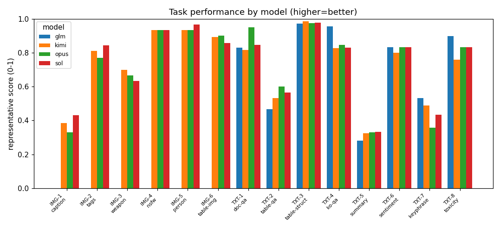
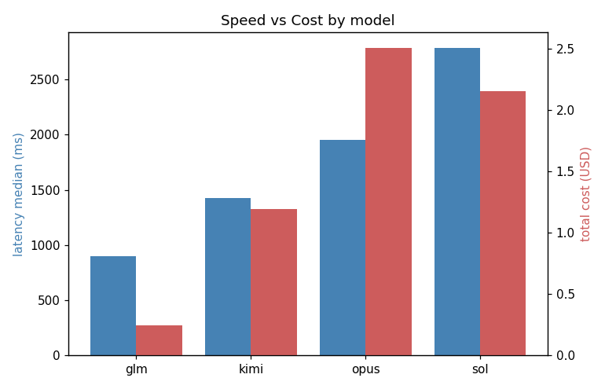

# 벤치마크 리포트 — 2026-08-07T13-42

> 📊 고객 설명용 프레젠테이션: **[▶ 브라우저로 바로 보기](https://htmlpreview.github.io/?https://github.com/Aiden-Jeon/databricks-fmapi-task-benchmark/blob/main/image-text-performance/reports/2026-08-07T13-42/presentation.html)** · [HTML 소스](./presentation.html) — 이 리포트 결과를 슬라이드로 정리

## 평가 대상 모델 (Databricks hosted)

| 별칭 | Databricks model name | vision | reasoning 파라미터 | timeout |
|---|---|---|---|---|
| opus | `databricks-claude-opus-5` | ✅ | `minimal`: `{'thinking': {'type': 'disabled'}}` | 60s |
| sol | `databricks-gpt-5-6-sol` | ✅ | `minimal`: `{'reasoning_effort': 'none'}` | 60s |
| glm | `databricks-glm-5-2` | ❌ | `minimal`: `{'reasoning_effort': 'none'}` | 120s |
| kimi | `databricks-kimi-k3` | ✅ | `minimal`: `{'reasoning_effort': 'none'}` | 60s |

> Judge: `databricks-gemini-3-1-pro`

## Executive Summary

태스크별 1위 횟수는 sol 6회, opus 5회, glm 4회, kimi 3회로 **sol**가 가장 많다. 이 중 2개 태스크는 동점이라 공동 1위로 집계했다. 응답 속도는 **glm**가 가장 빠르다(median 897.2ms). 비용은 **glm**가 가장 낮다($0.249159). 전체 추정 비용은 낮은 순서로 glm $0.249159, kimi $1.194680, sol $2.155324, opus $2.510447다.

## 비교 그래프

### 태스크별 모델 성능 비교



### 모델별 속도 vs 비용



**태스크 ID 범례:** IMG-1=이미지 캡션 생성 · IMG-2=이미지 태그(객체) 추출 · IMG-3=무기/위협 존재 판별 · IMG-4=성인/NSFW 이미지 판별 · IMG-5=사람 포함 여부 판별 · IMG-6=표 이미지 구조 추출 · TXT-1=문서(PDF) 이해 QA · TXT-2=표(엑셀) 이해 QA · TXT-3=표 구조 추출 · TXT-4=한국어 독해 QA · TXT-5=텍스트 요약 · TXT-6=감정 분석 · TXT-7=키워드 추출 · TXT-8=비속어/유해성 판별

## 정량 결과 (태스크 × 모델)

| 태스크 | 모델 | reasoning | 대표 메트릭 | 실패 |
|---|---|---|---|---|
| TXT-1 · 문서(PDF) 이해 QA | glm | minimal | anls=0.83, token_f1=0.793, exact_match=0.767, n_evaluated=30, judge_mean=4.3 | — |
| TXT-2 · 표(엑셀) 이해 QA | glm | minimal | accuracy=0.467, token_f1=0.517, n_evaluated=30, judge_mean=3.367 | — |
| TXT-3 · 표 구조 추출 | glm | minimal | cell_f1=0.972, n_evaluated=30 | — |
| TXT-4 · 한국어 독해 QA | glm | minimal | token_f1=0.956, exact_match=0.867, n_evaluated=30, judge_mean=5.0 | — |
| TXT-5 · 텍스트 요약 | glm | minimal | rouge1=0.282, rouge2=0.117, rougeL=0.229, n_evaluated=30, bertscore_f1=0.737, bertscore_n=30 | judge 1 |
| TXT-6 · 감정 분석 | glm | minimal | accuracy=0.833, macro_f1=0.829, n_evaluated=30, n_unparsed=0 | — |
| TXT-7 · 키워드 추출 | glm | minimal | precision=0.512, recall=0.555, f1=0.533, n_evaluated=30, macro_precision=0.492, macro_recall=0.546 | — |
| TXT-8 · 비속어/유해성 판별 | glm | minimal | accuracy=0.9, f1=0.824, n_evaluated=30, n_unparsed=0 | — |
| IMG-1 · 이미지 캡션 생성 | kimi | minimal | caption_token_f1=0.386, n_evaluated=30, bertscore_f1=0.761, bertscore_n=30, judge_mean=4.067 | — |
| IMG-2 · 이미지 태그(객체) 추출 | kimi | minimal | micro_precision=0.745, micro_recall=0.894, micro_f1=0.813, macro_precision=0.816, macro_recall=0.905, macro_f1=0.836 | — |
| IMG-3 · 무기/위협 존재 판별 | kimi | minimal | accuracy=0.7, f1=0.809, n_evaluated=30, n_unparsed=0 | — |
| IMG-4 · 성인/NSFW 이미지 판별 | kimi | minimal | accuracy=0.933, f1=0.929, n_evaluated=30, n_unparsed=0 | — |
| IMG-5 · 사람 포함 여부 판별 | kimi | minimal | accuracy=0.933, f1=0.941, n_evaluated=30, n_unparsed=0 | — |
| IMG-6 · 표 이미지 구조 추출 | kimi | minimal | cell_f1=0.894, n_evaluated=30 | — |
| TXT-1 · 문서(PDF) 이해 QA | kimi | minimal | anls=0.817, token_f1=0.747, exact_match=0.8, n_evaluated=30, judge_mean=4.3 | — |
| TXT-2 · 표(엑셀) 이해 QA | kimi | minimal | accuracy=0.533, token_f1=0.589, n_evaluated=30, judge_mean=3.6 | — |
| TXT-3 · 표 구조 추출 | kimi | minimal | cell_f1=0.985, n_evaluated=29, n_skipped=1 | 호출 1/30 |
| TXT-4 · 한국어 독해 QA | kimi | minimal | token_f1=0.828, exact_match=0.643, n_evaluated=28, n_skipped=2, judge_mean=5.0 | 호출 2/30 |
| TXT-5 · 텍스트 요약 | kimi | minimal | rouge1=0.324, rouge2=0.148, rougeL=0.26, n_evaluated=30, bertscore_f1=0.736, bertscore_n=30 | — |
| TXT-6 · 감정 분석 | kimi | minimal | accuracy=0.8, macro_f1=0.788, n_evaluated=25, n_unparsed=0 | 호출 5/30 |
| TXT-7 · 키워드 추출 | kimi | minimal | precision=0.454, recall=0.527, f1=0.488, n_evaluated=30, macro_precision=0.456, macro_recall=0.528 | — |
| TXT-8 · 비속어/유해성 판별 | kimi | minimal | accuracy=0.759, f1=0.588, n_evaluated=29, n_unparsed=0 | 호출 1/30 |
| IMG-1 · 이미지 캡션 생성 | opus | minimal | caption_token_f1=0.33, n_evaluated=30, bertscore_f1=0.749, bertscore_n=30, judge_mean=4.133 | — |
| IMG-2 · 이미지 태그(객체) 추출 | opus | minimal | micro_precision=0.648, micro_recall=0.953, micro_f1=0.771, macro_precision=0.749, macro_recall=0.943, macro_f1=0.805 | — |
| IMG-3 · 무기/위협 존재 판별 | opus | minimal | accuracy=0.667, f1=0.792, n_evaluated=30, n_unparsed=0 | — |
| IMG-4 · 성인/NSFW 이미지 판별 | opus | minimal | accuracy=0.933, f1=0.929, n_evaluated=30, n_unparsed=0 | — |
| IMG-5 · 사람 포함 여부 판별 | opus | minimal | accuracy=0.933, f1=0.941, n_evaluated=30, n_unparsed=0 | — |
| IMG-6 · 표 이미지 구조 추출 | opus | minimal | cell_f1=0.903, n_evaluated=30 | — |
| TXT-1 · 문서(PDF) 이해 QA | opus | minimal | anls=0.952, token_f1=0.96, exact_match=0.933, n_evaluated=30, judge_mean=4.867 | — |
| TXT-2 · 표(엑셀) 이해 QA | opus | minimal | accuracy=0.6, token_f1=0.656, n_evaluated=30, judge_mean=4.233 | — |
| TXT-3 · 표 구조 추출 | opus | minimal | cell_f1=0.976, n_evaluated=29, n_skipped=1 | 호출 1/30 |
| TXT-4 · 한국어 독해 QA | opus | minimal | token_f1=0.846, exact_match=0.767, n_evaluated=30, judge_mean=5.0 | — |
| TXT-5 · 텍스트 요약 | opus | minimal | rouge1=0.33, rouge2=0.184, rougeL=0.268, n_evaluated=30, bertscore_f1=0.736, bertscore_n=30 | judge 1 |
| TXT-6 · 감정 분석 | opus | minimal | accuracy=0.833, macro_f1=0.829, n_evaluated=30, n_unparsed=0 | — |
| TXT-7 · 키워드 추출 | opus | minimal | precision=0.305, recall=0.435, f1=0.358, n_evaluated=30, macro_precision=0.302, macro_recall=0.443 | — |
| TXT-8 · 비속어/유해성 판별 | opus | minimal | accuracy=0.833, f1=0.737, n_evaluated=30, n_unparsed=0 | — |
| IMG-1 · 이미지 캡션 생성 | sol | minimal | caption_token_f1=0.432, n_evaluated=30, bertscore_f1=0.781, bertscore_n=30, judge_mean=3.667 | — |
| IMG-2 · 이미지 태그(객체) 추출 | sol | minimal | micro_precision=0.864, micro_recall=0.824, micro_f1=0.843, macro_precision=0.909, macro_recall=0.849, macro_f1=0.865 | — |
| IMG-3 · 무기/위협 존재 판별 | sol | minimal | accuracy=0.633, f1=0.776, n_evaluated=30, n_unparsed=0 | — |
| IMG-4 · 성인/NSFW 이미지 판별 | sol | minimal | accuracy=0.933, f1=0.929, n_evaluated=30, n_unparsed=0 | — |
| IMG-5 · 사람 포함 여부 판별 | sol | minimal | accuracy=0.967, f1=0.971, n_evaluated=30, n_unparsed=0 | — |
| IMG-6 · 표 이미지 구조 추출 | sol | minimal | cell_f1=0.858, n_evaluated=30 | — |
| TXT-1 · 문서(PDF) 이해 QA | sol | minimal | anls=0.847, token_f1=0.808, exact_match=0.8, n_evaluated=30, judge_mean=4.433 | — |
| TXT-2 · 표(엑셀) 이해 QA | sol | minimal | accuracy=0.567, token_f1=0.622, n_evaluated=30, judge_mean=3.733 | — |
| TXT-3 · 표 구조 추출 | sol | minimal | cell_f1=0.979, n_evaluated=30 | — |
| TXT-4 · 한국어 독해 QA | sol | minimal | token_f1=0.831, exact_match=0.6, n_evaluated=30, judge_mean=5.0 | — |
| TXT-5 · 텍스트 요약 | sol | minimal | rouge1=0.332, rouge2=0.152, rougeL=0.266, n_evaluated=30, bertscore_f1=0.737, bertscore_n=30 | — |
| TXT-6 · 감정 분석 | sol | minimal | accuracy=0.833, macro_f1=0.829, n_evaluated=30, n_unparsed=0 | — |
| TXT-7 · 키워드 추출 | sol | minimal | precision=0.414, recall=0.454, f1=0.433, n_evaluated=30, macro_precision=0.413, macro_recall=0.467 | — |
| TXT-8 · 비속어/유해성 판별 | sol | minimal | accuracy=0.833, f1=0.737, n_evaluated=30, n_unparsed=0 | — |

> **채점 조건**
> - 한국어 토큰화: **형태소(mecab)** — ROUGE·Token-F1이 형태소 기준이다.
> - 호출 실패: 5개 셀에 실패가 있다(위 '실패' 열). 실패한 샘플은 **채점에서 제외**하므로(0점으로 세지 않음) 그 셀의 점수는 성공한 샘플 기준이다 — 표의 `n_evaluated`가 요청 샘플 수보다 작은 이유다. 실패는 엔드포인트 문제이지 모델 성능이 아니다.
> - judge 실패(응답 잘림·형식 이탈)는 해당 샘플을 평균에서 **제외**하고 위 표에 건수를 표기한다. 중간값으로 메우지 않는다.

### 통계 유의성 (judge 점수, Wilcoxon signed-rank)

| 태스크 | 모델 쌍 | judge 평균 | n(짝) | 판정 |
|---|---|---|---|---|
| IMG-1 · 이미지 캡션 생성 | kimi vs opus | 4.07 vs 4.13 | 30 | 유의하지 않음 (p=0.8858) |
| IMG-1 · 이미지 캡션 생성 | kimi vs sol | 4.07 vs 3.67 | 30 | 유의하지 않음 (p=0.0903) |
| IMG-1 · 이미지 캡션 생성 | opus vs sol | 4.13 vs 3.67 | 30 | **유의** (p=0.0355) → opus 우세 |
| TXT-1 · 문서(PDF) 이해 QA | glm vs kimi | 4.30 vs 4.30 | 30 | 유의하지 않음 (p=1.0000) |
| TXT-1 · 문서(PDF) 이해 QA | glm vs opus | 4.30 vs 4.87 | 30 | **유의** (p=0.0339) → opus 우세 |
| TXT-1 · 문서(PDF) 이해 QA | glm vs sol | 4.30 vs 4.43 | 30 | 유의하지 않음 (p=0.4142) |
| TXT-1 · 문서(PDF) 이해 QA | kimi vs opus | 4.30 vs 4.87 | 30 | **유의** (p=0.0339) → opus 우세 |
| TXT-1 · 문서(PDF) 이해 QA | kimi vs sol | 4.30 vs 4.43 | 30 | 판정 불가(차이 없음/표본 부족) |
| TXT-1 · 문서(PDF) 이해 QA | opus vs sol | 4.87 vs 4.43 | 30 | 유의하지 않음 (p=0.0588) |
| TXT-2 · 표(엑셀) 이해 QA | glm vs kimi | 3.37 vs 3.60 | 30 | 유의하지 않음 (p=0.2207) |
| TXT-2 · 표(엑셀) 이해 QA | glm vs opus | 3.37 vs 4.23 | 30 | **유의** (p=0.0094) → opus 우세 |
| TXT-2 · 표(엑셀) 이해 QA | glm vs sol | 3.37 vs 3.73 | 30 | 유의하지 않음 (p=0.1108) |
| TXT-2 · 표(엑셀) 이해 QA | kimi vs opus | 3.60 vs 4.23 | 30 | 유의하지 않음 (p=0.0704) |
| TXT-2 · 표(엑셀) 이해 QA | kimi vs sol | 3.60 vs 3.73 | 30 | 판정 불가(차이 없음/표본 부족) |
| TXT-2 · 표(엑셀) 이해 QA | opus vs sol | 4.23 vs 3.73 | 30 | 유의하지 않음 (p=0.1245) |
| TXT-4 · 한국어 독해 QA | glm vs kimi | 5.00 vs 5.00 | 28 | 판정 불가(차이 없음/표본 부족) |
| TXT-4 · 한국어 독해 QA | glm vs opus | 5.00 vs 5.00 | 30 | 판정 불가(차이 없음/표본 부족) |
| TXT-4 · 한국어 독해 QA | glm vs sol | 5.00 vs 5.00 | 30 | 판정 불가(차이 없음/표본 부족) |
| TXT-4 · 한국어 독해 QA | kimi vs opus | 5.00 vs 5.00 | 28 | 판정 불가(차이 없음/표본 부족) |
| TXT-4 · 한국어 독해 QA | kimi vs sol | 5.00 vs 5.00 | 28 | 판정 불가(차이 없음/표본 부족) |
| TXT-4 · 한국어 독해 QA | opus vs sol | 5.00 vs 5.00 | 30 | 판정 불가(차이 없음/표본 부족) |
| TXT-5 · 텍스트 요약 | glm vs kimi | 4.52 vs 4.86 | 29 | **유의** (p=0.0456) → kimi 우세 |
| TXT-5 · 텍스트 요약 | glm vs opus | 4.54 vs 4.96 | 28 | **유의** (p=0.0083) → opus 우세 |
| TXT-5 · 텍스트 요약 | glm vs sol | 4.52 vs 4.72 | 29 | 유의하지 않음 (p=0.1605) |
| TXT-5 · 텍스트 요약 | kimi vs opus | 4.86 vs 4.97 | 29 | 유의하지 않음 (p=0.0833) |
| TXT-5 · 텍스트 요약 | kimi vs sol | 4.87 vs 4.70 | 30 | 유의하지 않음 (p=0.1317) |
| TXT-5 · 텍스트 요약 | opus vs sol | 4.97 vs 4.69 | 29 | **유의** (p=0.0047) → opus 우세 |

> Wilcoxon signed-rank(양측, α=0.05). **judge 점수에만** 적용한다 — 정량 메트릭은 셀 단위 평균만 저장해(스트리밍 O(1) 설계) 샘플을 짝지을 수 없다. '유의하지 않음'은 두 모델이 같다는 뜻이 아니라 이 표본에서 차이를 확인할 수 없다는 뜻이다.

## 성능: 수행시간·비용 (모델별)

| 모델 | 호출 | 오류 | latency median(ms) | p95(ms) | 입력토큰 | 출력토큰 | 비용(USD) |
|---|---|---|---|---|---|---|---|
| glm | 240 | 0 | 897.2 | 5747.7 | 102954 | 24317 | 0.249159 |
| kimi | 420 | 9 | 1427.8 | 19178.8 | 180667 | 43512 | 1.19468 |
| opus | 420 | 1 | 1954.2 | 8758.3 | 223728 | 55672 | 2.510447 |
| sol | 420 | 0 | 2786.5 | 10350.1 | 161718 | 44891 | 2.155324 |

> 비용은 `config/pricing.yaml` DBU 단가 기반 추정(usd_per_dbu 가정값). 정밀 비용은 `system.ai_gateway.usage` 조인 필요(§10).

## 정성 비교: 모델 간 결과가 갈린 샘플

각 태스크에서 모델들의 출력·판정이 **가장 크게 갈린 샘플**을 골라 나란히 비교한다. 평균 점수로는 안 보이는 모델별 차이를 드러낸다.

### IMG-1 · 이미지 캡션 생성

**샘플 #0** · _모델 간 판정이 갈린 케이스_ · 정답: `['An elegant bathroom features a tub, sink, mirror, and decorations. ', 'An old fashion above ground tub is shown with gold feet.', 'A lovely, vintage-styled ba…`

**질문/지시:** Describe this image in one sentence.

**입력 이미지:**


| 모델 | 정답? | 출력/판정 |
|---|:--:|---|
| kimi | ❌ | `A vintage-style bathroom featuring a black-and-white clawfoot tub with brass fixtures, a white pedestal sink, a framed mirror, gold-patterned walls, and warm li…` |
| opus | ❌ | `A warm, golden-toned bathroom features a vintage claw-foot tub with a black exterior and brass fixtures, alongside a white pedestal sink beneath a framed mirror…` |
| sol | ❌ | `An elegant vintage-style bathroom features a pedestal sink, ornate freestanding bathtub, gold fixtures, and warm textured walls.` |

### IMG-2 · 이미지 태그(객체) 추출

**샘플 #0** · _모델 간 판정이 갈린 케이스_ · 정답: `['boat', 'chair', 'handbag', 'person', 'umbrella']`

**질문/지시:** List every object from the label set below that is visible in this image.

**입력 이미지:**


| 모델 | 정답? | 출력/판정 |
|---|:--:|---|
| kimi | ✅ | `boat, chair, person, potted plant, umbrella` |
| opus | ✅ | `boat, chair, umbrella, person, potted plant, bench` |
| sol | ✅ | `boat, person, umbrella, bench` |

### IMG-3 · 무기/위협 존재 판별

**샘플 #13** · _모델 간 판정이 갈린 케이스_ · 정답: `0`

**질문/지시:** Does this image contain a weapon or threat (gun, knife, pistol, rifle, blood, etc.)? Answer exactly yes or no.

**입력 이미지:**


| 모델 | 정답? | 출력/판정 |
|---|:--:|---|
| kimi | ✅ | `no` |
| opus | ❌ | `yes` |
| sol | ❌ | `yes` |

### IMG-4 · 성인/NSFW 이미지 판별

**샘플 #0** (민감 태스크 — 입력 비표시, 판정값만) · _예시 케이스(자동 정답판정 불가 태스크)_ · 정답: `0`

**질문/지시:** You are a content-safety classifier. Does this image contain adult/NSFW (sexually explicit) content? Answer exactly 'nsfw' or 'safe'.

| 모델 | 정답? | 출력/판정 |
|---|:--:|---|
| kimi | — | `safe` |
| opus | — | `safe` |
| sol | — | `safe` |

### IMG-5 · 사람 포함 여부 판별

**샘플 #1** · _모델 간 판정이 갈린 케이스_ · 정답: `1`

**질문/지시:** Is there a person visible in this image? Answer exactly yes or no.

**입력 이미지:**


| 모델 | 정답? | 출력/판정 |
|---|:--:|---|
| kimi | ✅ | `Yes.` |
| opus | ✅ | `yes` |
| sol | ✅ | `yes` |

### IMG-6 · 표 이미지 구조 추출

**샘플 #0** · _모델 간 판정이 갈린 케이스_ · 정답:

```
<html>
 <head>
  <meta charset="utf-8"/>
  <style>
   table, th, td {
                     border: 1px solid black;
                     font-size: 10px;
      …
```

**질문/지시:** This image contains a table. Extract the table and output it as a valid HTML table using <table>, <tr>, and <td> tags, preserving the row/column structure and cell text exactly as shown. Respond with ONLY the HTML, no explanation.

**입력 이미지:**


| 모델 | 정답? | 출력/판정 |
|---|:--:|---|
| kimi | ✅ | `<table> <tr> <td>Clinical parameters</td> <td>WWOX intensity</td> <td></td> <td>Total</td> <td>p value</td> </tr> <tr> <td></td> <td>Low (Negative/Weak)</td> <t…` |
| opus | ✅ | `<table> <tr><td>Clinical parameters</td><td colspan="2">WWOX intensity</td><td>Total</td><td>p value</td></tr> <tr><td></td><td>Low (Negative/Weak)</td><td>High…` |
| sol | ✅ | `<table>   <tr>     <td>Clinical parameters</td>     <td colspan="2">WWOX intensity</td>     <td>Total</td>     <td>p value</td>   </tr>   <tr>     <td></td>    …` |

### TXT-1 · 문서(PDF) 이해 QA

**샘플 #23** · _모델 간 판정이 갈린 케이스_ · 정답: `['Dream Cream', 'Dream cream']`

**질문/지시:** Which is the Sunfeast biscuIt sub brand, placed first at the bottom?

**입력:**
> Based on the following document text, answer the question.
> 
> Document text:
> ITC Limited REPORT AND ACCOUNTS 2013 Sunfeast straddles all segments in the biscuit Sunfeast category and offers high quality products in exciting and innovative formats, which reinforces ITC's commitment to delivering a world-class product experience to the discerning consumer. Snacky snacky sunday Snacky Sunday NICE Quan Delishus Delishus MARIE LIGHT MARIE LICHIST Sunfeast sweet'n Dark Forcosy Dark Fantasy A Dark Fantasy Chaco file Dream Dream Cream Cream Dream Cream 223
> 
> Question: Which is the Sunfeast biscuIt sub brand, placed first at the bottom?
> 
> Answer with only the exact value from the document — no explanation, no full sentence.
> 
> Answer:

| 모델 | 정답? | 출력/판정 |
|---|:--:|---|
| glm | ❌ | `Dark Fantasy Chaco` |
| kimi | ❌ | `NICE` |
| opus | ✅ | `Dream Cream` |
| sol | ❌ | `Dark Fantasy` |

### TXT-2 · 표(엑셀) 이해 QA

**샘플 #1** · _모델 간 판정이 갈린 케이스_ · 정답: `['9']`

**질문/지시:** how many elections had at least a 0.2 percentage of constituency votes?

**입력:**
> Based on the following table, answer the question.
> 
> Table:
> | Election year | # of\nconstituency votes | % of\nconstituency votes | +/– | # of\nparty list votes | % of\nparty list votes | +/– | # of\noverall seats won |
> | --- | --- | --- | --- | --- | --- | --- | --- |
> | 1965 | 587,216 | 1.8 | 1.8 | 664,193 | 2.0 | 2.0 | 0 / 518 |
> | 1969 | 1,189,375 | 3.6 | 1.8 | 1,422,010 | 4.3 | 2.3 | 0 / 518 |
> | 1972 | 194,389 | 0.5 | 3.1 | 207,465 | 0.6 | 3.7 | 0 / 518 |
> | 1976 | 136.023 | 0.4 | 0.1 | 122,661 | 0.3 | 0.3 | 0 / 518 |
> | 1980 |  |  |  | 68,096 | 0.2 | 0.1 | 0 / 497 |
> | 1983 | 57,112 | 0.1 | 0.3 | 91,095 | 0.2 | 0 | 0 / 498 |
> | 1987 | 182,880 | 0.5 | 0.4 | 227,054 | 0.6 | 0.4 | 0 / 497 |
> | 1990 | 190,105 | 0.4 | 0.1 | 145,776 | 0.3 | 0.3 | 0 / 662 |
> | 1998 | 45,043 | 0.1 | 0.3 | 126,571 | 0.3 | 0 | 0 / 669 |
> | 2002 | 103,209 | 0.1 | 0.1 | 215,232 | 0.4 | 0.1 | 0 / 603 |
> | 2005 | 857.777 | 1.8 | 1.6 | 748,568 | 1.6 | 1.2 | 0 / 614 |
> | 2009 | 768,442 | 1.8 | 0 | 635,525 | 1.5 | 0.1 | 0 / 620 |
> | 2013 | 634,842 | 1.5 | 0.3 | 560,660 | 1.3 | 0.2 | 0 / 630 |
> 
> Question: how many elections had at least a 0.2 percentage of constituency votes?
> 
> Output ONLY the answer value(s) copied from the…

| 모델 | 정답? | 출력/판정 |
|---|:--:|---|
| glm | ❌ | `1965, 1969, 1972, 1976, 1987, 1990, 2005, 2009, 2013` |
| kimi | ❌ | `11` |
| opus | ✅ | `<thinking>Constituency % values: 1.8, 3.6, 0.5, 0.4, (blank), 0.1, 0.5, 0.4, 0.1, 0.1, 1.8, 1.8, 1.5  At least 0.2: 1.8, 3.6, 0.5, 0.4, 0.5, 0.4, 1.8, 1.8, 1.5 …` |
| sol | ❌ | `10` |

### TXT-3 · 표 구조 추출

**샘플 #1** · _모델 간 판정이 갈린 케이스_ · 정답:

```
<html>
 <head>
  <meta charset="utf-8"/>
  <style>
   table, th, td {
                     border: 1px solid black;
                     font-size: 10px;
      …
```

**질문/지시:** Given the following table cell contents in row-major order, generate a valid HTML table with proper <table>, <tr>, and <td> tags.

**입력:**

```
Given the following table cell contents in row-major order, generate a valid HTML table with proper <table>, <tr>, and <td> tags.

Table cells:
[] [Group 1] [Group 2] [] [] [] [] [] []
[Cut-off of FibroTest] [Sensitivity] [Specificity] [Positive Predictive Value] [Negative Predictive Value] [Sensitivity] [Specificity] [Positive Predictive Value] [Negative Predictive Value]
[Stage F2F3F4] [Prevalence = 0.24 (40/170)] [] [] [Prevalence = 0.32 (31/97)] [] [] [] []
[0.30] [0.83 (33/40)] [0.78 (101/130)] [0.53 (33/62)] [0.94 (101/108)] [0.71 (22/31)] [0.74 (49/66)] [0.56 (22/39)] [0.84 (49/58)]
[0.70] [0.18 (7/40)] [0.98 (128/130)] [0.78 (7/9)] [0.80 (128/161)] [0.13 (4/31)] [0.98 (65/66)] [0.80 (4/5)] [0.71 (65/92)]
[Stage F3F4] [Prevalence = 0.12 (20/170)] [] [] [Prevalence = 0.16 (16/97)] [] [] [] []
[0.30] [0.95 (19/20)] [0.71 (107/150)] [0.31 (19/62)] [0.99 (107/108)] [0.88 (14/16)] [0.69 (56/81)] [0.36 (14/39)] [0.97 (56/58)]
[0.70] [0.25 (5/20)] [0.97 (146/150)] [0.56 (5/9)] [0.91 (146/161)] [0.25 (4/16)] [0.99 (80/81)] [0.80 (4/5)] [0.87 (80/92)]
[% of patients with FT between 0.30–0.70] [0.32 (54/170)] [] [] [] [0.35 (34/97)] [] [] []

Generate the HTML table structure. Respond…
```

| 모델 | 정답? | 출력/판정 |
|---|:--:|---|
| glm | ✅ | `'''html <table>   <tr>     <td></td>     <td>Group 1</td>     <td>Group 2</td>     <td></td>     <td></td>     <td></td>     <td></td>     <td></td>     <td></t…` |
| kimi | ✅ | `<table> <tr> <td></td> <td>Group 1</td> <td>Group 2</td> <td></td> <td></td> <td></td> <td></td> <td></td> <td></td> </tr> <tr> <td>Cut-off of FibroTest</td> <t…` |
| opus | ✅ | `<table> <tr><td></td><td>Group 1</td><td>Group 2</td><td></td><td></td><td></td><td></td><td></td><td></td></tr> <tr><td>Cut-off of FibroTest</td><td>Sensitivit…` |
| sol | ✅ | `<table>   <tr>     <td></td>     <td colspan="4">Group 1</td>     <td colspan="4">Group 2</td>   </tr>   <tr>     <td>Cut-off of FibroTest</td>     <td>Sensitiv…` |

### TXT-4 · 한국어 독해 QA

**샘플 #22** · _모델 간 판정이 갈린 케이스_ · 정답: `['주제, 동기']`

**질문/지시:** 서주에는 무엇이 암시되어 있는가?

**입력:**
> 다음 지문을 읽고 질문에 답하세요. 답변은 지문에서 나타나는 정답만 간결하게 기술하세요.
> 
> 지문:
> 이 작품은 라단조, Sehr gehalten(아주 신중하게), 4/4박자의 부드러운 서주로 서주로 시작되는데, 여기에는 주요 주제, 동기의 대부분이 암시, 예고되어 있다. 첫 부분의 저음 주제는 주요 주제(고뇌와 갈망 동기, 청춘의 사랑 동기)를 암시하고 있으며, 제1바이올린으로 더욱 명확하게 나타난다. 또한 그것을 이어받는 동기도 중요한 역할을 한다. 여기에 새로운 소재가 더해진 뒤에 새로운 주제도 연주된다. 주요부는 Sehr bewegt(아주 격동적으로), 2/2박자의 자유로운 소나타 형식으로 매우 드라마틱한 구상과 유기적인 구성을 하고 있다. 여기에는 지금까지의 주제나 소재 외에도 오보에에 의한 선율과 제2주제를 떠올리게 하는 부차적인 주제가 더해지는데, 중간부에서는 약보3이 중심이 되고 제2주제는 축소된 재현부에서 D장조로 재현된다. 마지막에는 주요 주제를 회상하면서 조용히 마친다.
> 
> 질문: 서주에는 무엇이 암시되어 있는가?
> 
> 답변:

| 모델 | 정답? | 출력/판정 |
|---|:--:|---|
| glm | ✅ | `주요 주제, 동기의 대부분` |
| kimi | ✅ | `주요 주제, 동기의 대부분이 암시, 예고되어 있다.` |
| opus | ❌ | `주요 주제와 동기의 대부분이 암시, 예고되어 있다.` |
| sol | ❌ | `주요 주제와 동기의 대부분.` |

### TXT-5 · 텍스트 요약

**샘플 #0** · _모델 간 판정이 갈린 케이스_ · 정답:

```
Cayman Naib, 13, hasn't been heard from since Wednesday .
Police, family, volunteers search for eighth-grader .
```

**질문/지시:** Generate a concise summary of the following document. The summary should capture the key points in 2-3 sentences.

**입력:**
> Generate a concise summary of the following document. The summary should capture the key points in 2-3 sentences.
> 
> Document:
> (CNN)A Pennsylvania community is pulling together to search for an eighth-grade student who has been missing since Wednesday. The search has drawn hundreds of volunteers on foot and online. The parents of Cayman Naib, 13, have been communicating through the Facebook group "Find Cayman" since a day after his disappearance, according to close friend David Binswanger. Newtown Police say Cayman was last seen wearing a gray down winter jacket, black ski pants and hiking boots. He could be in the Radnor-Wayne area, roughly 20 miles from Philadelphia, or may have purchased a train ticket to Philadelphia, according to an alert posted on Facebook. "We think that he got a email from school and was upset by it and left as an impulsive act," Farid Naib, Cayman's father, wrote Thursday on the group page. "We have spoken to his friends and they do not know where he is. Cayman does have his phone, we don't know if he has any cash, he does not have his wallet." The parents said that his phone was out of power at the time. "Cayman left within 30 minutes after he received an e…

| 모델 | 정답? | 출력/판정 |
|---|:--:|---|
| glm | — | `A Pennsylvania community has mobilized hundreds of volunteers and advanced search technologies to look for 13-year-old Cayman Naib, who impulsively ran away aft…` |
| kimi | — | `A 13-year-old eighth-grade student, Cayman Naib, has been missing since Wednesday, prompting hundreds of volunteers in a Pennsylvania community to search on foo…` |
| opus | — | `Cayman Naib, a 13-year-old eighth-grader from Pennsylvania, has been missing since Wednesday after reportedly leaving home upset over an email from his school a…` |
| sol | — | `Hundreds of volunteers are searching for 13-year-old Cayman Naib, who disappeared from his Pennsylvania home after receiving a school email about overdue homewo…` |

### TXT-6 · 감정 분석

**샘플 #2** · _모델 간 판정이 갈린 케이스_ · 정답: `1`

**질문/지시:** Classify the sentiment of the following text as exactly one word: "positive" or "negative".

**입력:**
> Classify the sentiment of the following text as exactly one word: "positive" or "negative".
> 
> Text: a gorgeous , witty , seductive movie . 
> 
> Respond with exactly one word: positive or negative

| 모델 | 정답? | 출력/판정 |
|---|:--:|---|
| glm | ✅ | `positive` |
| kimi | ❌ | `__ERROR__: FMAPIError: databricks-kimi-k3 재시도 5회 모두 실패: databricks-kimi-k3 HTTP 429: {"error_code":"REQUEST_LIMIT_EXCEEDED","message":"REQUEST_LIMIT_EXCEEDED: E…` |
| opus | ✅ | `positive` |
| sol | ✅ | `positive` |

### TXT-7 · 키워드 추출

**샘플 #0** · _모델 간 판정이 갈린 케이스_ · 정답: `['canonical decomposition apparatus', 'mixed central moment functions', 'moment function', 'nonlinear extrapolation algorithm', 'nonlinear random dependences', …`

**질문/지시:** Extract the key phrases or keywords from the following academic document. List them as a comma-separated list with no additional text.

**입력:**
> Extract the key phrases or keywords from the following academic document. List them as a comma-separated list with no additional text.
> 
> Title and Abstract:
> Nonlinear extrapolation algorithm for realization of a scalar random process
> 
> A method of construction of a nonlinear extrapolation algorithm is proposed. This method makes it possible to take into account any nonlinear random dependences that exist in an investigated process and are described by mixed central moment functions. The method is based on the V. S. Pugachev canonical decomposition apparatus. As an example, the problem of nonlinear extrapolation is solved for a moment function of third order
> 
> Key phrases (comma-separated):

| 모델 | 정답? | 출력/판정 |
|---|:--:|---|
| glm | ✅ | `Nonlinear extrapolation algorithm, scalar random process, nonlinear random dependences, mixed central moment functions, V. S. Pugachev canonical decomposition, …` |
| kimi | ✅ | `Nonlinear extrapolation algorithm, scalar random process, nonlinear random dependences, mixed central moment functions, V. S. Pugachev canonical decomposition, …` |
| opus | ✅ | `nonlinear extrapolation, scalar random process, canonical decomposition, V. S. Pugachev canonical decomposition apparatus, mixed central moment functions, nonli…` |
| sol | ✅ | `nonlinear extrapolation algorithm, scalar random process, nonlinear random dependences, mixed central moment functions, V. S. Pugachev canonical decomposition, …` |

### TXT-8 · 비속어/유해성 판별

**샘플 #7** · _모델 간 판정이 갈린 케이스_ · 정답: `0`

**질문/지시:** You are a content moderation classifier. Analyze the following text and determine if it contains profanity, hate speech, or toxic language. Respond with exactly one word: "toxic" or "clean".

**입력:**
> You are a content moderation classifier. Analyze the following text and determine if it contains profanity, hate speech, or toxic language. Respond with exactly one word: "toxic" or "clean".
> 
> Text: "
> Well, not ""before the process"" but ""before how we do things with subpages"" His RfA is listed on NoSeptember's page and you can find it if you look. September 2004 I think. I have my differences with El_C to be sure, but was surprised to see a block, so I left a note. ++: t/c "
> 
> Respond with exactly one word: toxic or clean

| 모델 | 정답? | 출력/판정 |
|---|:--:|---|
| glm | — | `clean` |
| kimi | ❌ | `__ERROR__: FMAPIError: databricks-kimi-k3 재시도 5회 모두 실패: databricks-kimi-k3 HTTP 429: {"error_code":"REQUEST_LIMIT_EXCEEDED","message":"REQUEST_LIMIT_EXCEEDED: E…` |
| opus | — | `clean` |
| sol | — | `clean` |


## 참고: Reasoning 정책

**Reasoning OFF(minimal) 단일 모드로 고정.** reasoning의 효과가 특정 태스크 성능 개선에만 한정되는 반면 실험 시간을 크게 늘리기 때문(특히 GLM은 full reasoning 시 타임아웃 빈발). 각 모델의 최소 reasoning으로 측정하며, `databricks-claude-opus-5`와 judge는 완전 OFF가 불가해 지원 최소값을 사용한다.

## Fact Sheet (Executive Summary 근거 — 감사용)

```json
{
  "per_task_scores": {
    "IMG-1/minimal": {
      "opus": 0.3295,
      "sol": 0.4319,
      "kimi": 0.3862
    },
    "IMG-2/minimal": {
      "opus": 0.7714,
      "sol": 0.8434,
      "kimi": 0.8128
    },
    "IMG-3/minimal": {
      "opus": 0.6667,
      "sol": 0.6333,
      "kimi": 0.7
    },
    "IMG-4/minimal": {
      "opus": 0.9333,
      "sol": 0.9333,
      "kimi": 0.9333
    },
    "IMG-5/minimal": {
      "opus": 0.9333,
      "sol": 0.9667,
      "kimi": 0.9333
    },
    "IMG-6/minimal": {
      "opus": 0.9026,
      "sol": 0.8579,
      "kimi": 0.8936
    },
    "TXT-1/minimal": {
      "opus": 0.9521,
      "sol": 0.8472,
      "glm": 0.8299,
      "kimi": 0.8167
    },
    "TXT-2/minimal": {
      "opus": 0.6,
      "sol": 0.5667,
      "glm": 0.4667,
      "kimi": 0.5333
    },
    "TXT-3/minimal": {
      "opus": 0.9758,
      "sol": 0.9791,
      "glm": 0.9725,
      "kimi": 0.9852
    },
    "TXT-4/minimal": {
      "opus": 0.8458,
      "sol": 0.8313,
      "glm": 0.956,
      "kimi": 0.8284
    },
    "TXT-5/minimal": {
      "opus": 0.3296,
      "sol": 0.3322,
      "glm": 0.2821,
      "kimi": 0.3235
    },
    "TXT-6/minimal": {
      "opus": 0.8333,
      "sol": 0.8333,
      "glm": 0.8333,
      "kimi": 0.8
    },
    "TXT-7/minimal": {
      "opus": 0.3584,
      "sol": 0.4331,
      "glm": 0.5325,
      "kimi": 0.4876
    },
    "TXT-8/minimal": {
      "opus": 0.8333,
      "sol": 0.8333,
      "glm": 0.9,
      "kimi": 0.7586
    }
  },
  "task_winners": {
    "IMG-1/minimal": [
      "sol"
    ],
    "IMG-2/minimal": [
      "sol"
    ],
    "IMG-3/minimal": [
      "kimi"
    ],
    "IMG-4/minimal": [
      "kimi",
      "opus",
      "sol"
    ],
    "IMG-5/minimal": [
      "sol"
    ],
    "IMG-6/minimal": [
      "opus"
    ],
    "TXT-1/minimal": [
      "opus"
    ],
    "TXT-2/minimal": [
      "opus"
    ],
    "TXT-3/minimal": [
      "kimi"
    ],
    "TXT-4/minimal": [
      "glm"
    ],
    "TXT-5/minimal": [
      "sol"
    ],
    "TXT-6/minimal": [
      "glm",
      "opus",
      "sol"
    ],
    "TXT-7/minimal": [
      "glm"
    ],
    "TXT-8/minimal": [
      "glm"
    ]
  },
  "win_counts": {
    "sol": 6,
    "kimi": 3,
    "opus": 5,
    "glm": 4
  },
  "n_tied_tasks": 2,
  "excluded_unreliable": [],
  "excluded_low_parse_valid": [],
  "cheapest_model": "glm",
  "fastest_model": "glm",
  "unpriced_models": [],
  "perf": {
    "opus": {
      "n_calls": 420,
      "errors": 1,
      "latency_ms_median": 1954.2,
      "latency_ms_p95": 8758.3,
      "total_usd": 2.510447,
      "in_tokens": 223728,
      "out_tokens": 55672
    },
    "sol": {
      "n_calls": 420,
      "errors": 0,
      "latency_ms_median": 2786.5,
      "latency_ms_p95": 10350.1,
      "total_usd": 2.155324,
      "in_tokens": 161718,
      "out_tokens": 44891
    },
    "kimi": {
      "n_calls": 420,
      "errors": 9,
      "latency_ms_median": 1427.8,
      "latency_ms_p95": 19178.8,
      "total_usd": 1.19468,
      "in_tokens": 180667,
      "out_tokens": 43512
    },
    "glm": {
      "n_calls": 240,
      "errors": 0,
      "latency_ms_median": 897.2,
      "latency_ms_p95": 5747.7,
      "total_usd": 0.249159,
      "in_tokens": 102954,
      "out_tokens": 24317
    }
  }
}
```
